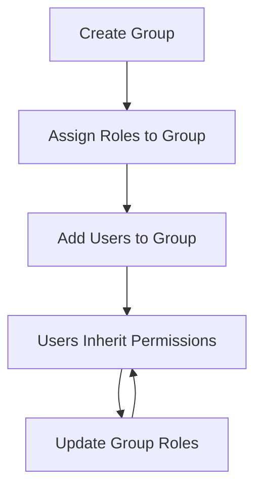

## Overview

The Groups API provides endpoints for managing user groups. Groups allow you to organize users and assign roles at the group level, making it easier to manage permissions for multiple users.

## List Groups

Retrieve all groups for the current tenant with optional search filtering.

<CodeGroup>
```bash cURL
curl -X GET "https://api.example.com/api/v1/identity/groups?search=admin" \
  -H "Authorization: Bearer {access_token}"
```

```csharp C#
var query = new GetGroupsQuery("admin");
var groups = await mediator.Send(query);
```
</CodeGroup>

### HTTP Request

`GET /api/v1/identity/groups`

### Authorization

Requires `Permissions.Groups.View` permission.

### Query Parameters

<ParamField query="search" type="string">
  Optional search term to filter groups by name or description
</ParamField>

### Response

Returns an array of `GroupDto` objects.

<ResponseField name="id" type="guid">
  Group's unique identifier
</ResponseField>

<ResponseField name="name" type="string">
  Group name
</ResponseField>

<ResponseField name="description" type="string">
  Group description (optional)
</ResponseField>

<ResponseField name="isDefault" type="boolean">
  Whether this is a default group (new users are automatically added)
</ResponseField>

<ResponseField name="isSystemGroup" type="boolean">
  Whether this is a system-managed group (cannot be deleted)
</ResponseField>

<ResponseField name="memberCount" type="integer">
  Number of users in the group
</ResponseField>

<ResponseField name="roleIds" type="array<string>">
  Array of role IDs assigned to the group
</ResponseField>

<ResponseField name="roleNames" type="array<string>">
  Array of role names assigned to the group
</ResponseField>

<ResponseField name="createdAt" type="datetime">
  Timestamp when the group was created
</ResponseField>

### Response Example

```json
[
  {
    "id": "3fa85f64-5717-4562-b3fc-2c963f66afa6",
    "name": "Administrators",
    "description": "System administrators group",
    "isDefault": false,
    "isSystemGroup": true,
    "memberCount": 5,
    "roleIds": ["admin-role-id"],
    "roleNames": ["Administrator"],
    "createdAt": "2026-01-15T10:30:00Z"
  },
  {
    "id": "7b9c3d2a-8e5f-4a6b-9c7d-1e2f3a4b5c6d",
    "name": "Managers",
    "description": "Department managers",
    "isDefault": false,
    "isSystemGroup": false,
    "memberCount": 12,
    "roleIds": ["manager-role-id"],
    "roleNames": ["Manager"],
    "createdAt": "2026-02-01T14:20:00Z"
  }
]
```

---

## Get Group by ID

Retrieve a specific group by its unique identifier.

<CodeGroup>
```bash cURL
curl -X GET https://api.example.com/api/v1/identity/groups/{groupId} \
  -H "Authorization: Bearer {access_token}"
```

```csharp C#
var query = new GetGroupByIdQuery(groupId);
var group = await mediator.Send(query);
```
</CodeGroup>

### HTTP Request

`GET /api/v1/identity/groups/{id}`

### Authorization

Requires `Permissions.Groups.View` permission.

### Path Parameters

<ParamField path="id" type="guid" required>
  The unique identifier of the group
</ParamField>

### Response

Returns a `GroupDto` object with group details.

---

## Create Group

Create a new group with optional role assignments.

<CodeGroup>
```bash cURL
curl -X POST https://api.example.com/api/v1/identity/groups \
  -H "Authorization: Bearer {access_token}" \
  -H "Content-Type: application/json" \
  -d '{
    "name": "Engineering Team",
    "description": "Software engineering department",
    "isDefault": false,
    "roleIds": ["developer-role-id", "viewer-role-id"]
  }'
```

```csharp C#
var command = new CreateGroupCommand(
    Name: "Engineering Team",
    Description: "Software engineering department",
    IsDefault: false,
    RoleIds: new List<string> { "developer-role-id", "viewer-role-id" }
);

var group = await mediator.Send(command);
```
</CodeGroup>

### HTTP Request

`POST /api/v1/identity/groups`

### Authorization

Requires `Permissions.Groups.Create` permission.

### Request Body

<ParamField body="name" type="string" required>
  Group name (must be unique within the tenant)
</ParamField>

<ParamField body="description" type="string">
  Group description (optional)
</ParamField>

<ParamField body="isDefault" type="boolean" required>
  Whether new users should be automatically added to this group
</ParamField>

<ParamField body="roleIds" type="array<string>">
  Array of role IDs to assign to the group (optional)
</ParamField>

### Response

Returns the created `GroupDto` object.

### Response Example

```json
{
  "id": "9a8b7c6d-5e4f-3a2b-1c0d-9e8f7a6b5c4d",
  "name": "Engineering Team",
  "description": "Software engineering department",
  "isDefault": false,
  "isSystemGroup": false,
  "memberCount": 0,
  "roleIds": ["developer-role-id", "viewer-role-id"],
  "roleNames": ["Developer", "Viewer"],
  "createdAt": "2026-03-06T15:45:00Z"
}
```

---

## Update Group

Update an existing group's details and role assignments.

<CodeGroup>
```bash cURL
curl -X PUT https://api.example.com/api/v1/identity/groups/{groupId} \
  -H "Authorization: Bearer {access_token}" \
  -H "Content-Type: application/json" \
  -d '{
    "name": "Engineering Team",
    "description": "Updated description",
    "isDefault": true,
    "roleIds": ["developer-role-id"]
  }'
```

```csharp C#
var command = new UpdateGroupCommand(
    Id: groupId,
    Name: "Engineering Team",
    Description: "Updated description",
    IsDefault: true,
    RoleIds: new List<string> { "developer-role-id" }
);

await mediator.Send(command);
```
</CodeGroup>

### HTTP Request

`PUT /api/v1/identity/groups/{id}`

### Authorization

Requires `Permissions.Groups.Update` permission.

### Path Parameters

<ParamField path="id" type="guid" required>
  The unique identifier of the group to update
</ParamField>

### Request Body

Same as Create Group request body.

### Response

Returns `200 OK` on successful update.

---

## Delete Group

Soft delete a group. System groups cannot be deleted.

<CodeGroup>
```bash cURL
curl -X DELETE https://api.example.com/api/v1/identity/groups/{groupId} \
  -H "Authorization: Bearer {access_token}"
```

```csharp C#
var command = new DeleteGroupCommand(groupId);
await mediator.Send(command);
```
</CodeGroup>

### HTTP Request

`DELETE /api/v1/identity/groups/{id}`

### Authorization

Requires `Permissions.Groups.Delete` permission.

### Path Parameters

<ParamField path="id" type="guid" required>
  The unique identifier of the group to delete
</ParamField>

### Response

Returns `200 OK` on successful deletion.

### Notes

- System groups (where `isSystemGroup = true`) cannot be deleted
- Deleting a group does not delete its members, only their group membership
- Users in the deleted group will lose permissions derived from group role assignments

---

## Get Group Members

Retrieve all members of a specific group.

<CodeGroup>
```bash cURL
curl -X GET https://api.example.com/api/v1/identity/groups/{groupId}/members \
  -H "Authorization: Bearer {access_token}"
```

```csharp C#
var query = new GetGroupMembersQuery(groupId);
var members = await mediator.Send(query);
```
</CodeGroup>

### HTTP Request

`GET /api/v1/identity/groups/{id}/members`

### Authorization

Requires `Permissions.Groups.View` permission.

### Path Parameters

<ParamField path="id" type="guid" required>
  The unique identifier of the group
</ParamField>

### Response

Returns an array of `GroupMemberDto` objects containing user information.

---

## Add Users to Group

Add one or more users to a group.

<CodeGroup>
```bash cURL
curl -X POST https://api.example.com/api/v1/identity/groups/{groupId}/members \
  -H "Authorization: Bearer {access_token}" \
  -H "Content-Type: application/json" \
  -d '{
    "userIds": [
      "user-id-1",
      "user-id-2",
      "user-id-3"
    ]
  }'
```

```csharp C#
var command = new AddUsersToGroupCommand(
    GroupId: groupId,
    UserIds: new List<string> { "user-id-1", "user-id-2", "user-id-3" }
);

var response = await mediator.Send(command);
```
</CodeGroup>

### HTTP Request

`POST /api/v1/identity/groups/{groupId}/members`

### Authorization

Requires `Permissions.Groups.ManageMembers` permission.

### Path Parameters

<ParamField path="groupId" type="guid" required>
  The unique identifier of the group
</ParamField>

### Request Body

<ParamField body="userIds" type="array<string>" required>
  Array of user IDs to add to the group
</ParamField>

### Response

Returns information about the operation, including:
- Count of users successfully added
- List of users already in the group (if any)

---

## Remove User from Group

Remove a specific user from a group.

<CodeGroup>
```bash cURL
curl -X DELETE https://api.example.com/api/v1/identity/groups/{groupId}/members/{userId} \
  -H "Authorization: Bearer {access_token}"
```

```csharp C#
var command = new RemoveUserFromGroupCommand(groupId, userId);
await mediator.Send(command);
```
</CodeGroup>

### HTTP Request

`DELETE /api/v1/identity/groups/{groupId}/members/{userId}`

### Authorization

Requires `Permissions.Groups.ManageMembers` permission.

### Path Parameters

<ParamField path="groupId" type="guid" required>
  The unique identifier of the group
</ParamField>

<ParamField path="userId" type="string" required>
  The unique identifier of the user to remove
</ParamField>

### Response

Returns `200 OK` on successful removal.

---

## Get User Groups

Retrieve all groups that a specific user belongs to.

<CodeGroup>
```bash cURL
curl -X GET https://api.example.com/api/v1/identity/users/{userId}/groups \
  -H "Authorization: Bearer {access_token}"
```

```csharp C#
var query = new GetUserGroupsQuery(userId);
var groups = await mediator.Send(query);
```
</CodeGroup>

### HTTP Request

`GET /api/v1/identity/users/{userId}/groups`

### Authorization

Requires `Permissions.Users.View` permission.

### Path Parameters

<ParamField path="userId" type="string" required>
  The unique identifier of the user
</ParamField>

### Response

Returns an array of `GroupDto` objects representing the user's group memberships.

---

## Group-Based Permissions

Groups provide an efficient way to manage permissions at scale:

1. **Role Assignment**: Roles are assigned to groups, not individual users
2. **Permission Inheritance**: Users inherit all permissions from their group's roles
3. **Centralized Management**: Update permissions for multiple users by modifying group roles
4. **Default Groups**: Automatically add new users to specific groups

### Example Workflow



### Best Practices

<Tip>
  Use groups to organize users by department, project, or function for easier permission management.
</Tip>

<Note>
  System groups are protected and cannot be deleted. Use them for critical organizational structures.
</Note>

<Warning>
  Removing a user from a group immediately revokes all permissions derived from that group's roles.
</Warning>
