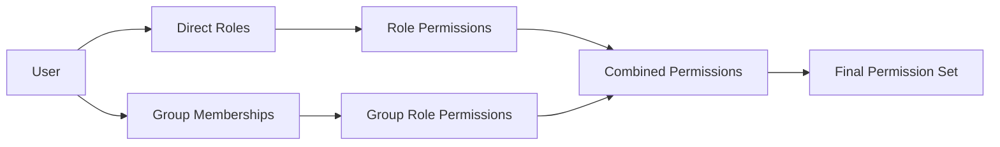

## Overview

The Permissions API provides endpoints for retrieving user permissions. Permissions are derived from the user's assigned roles and group memberships.

## Get Current User Permissions

Retrieve all permissions for the currently authenticated user.

<CodeGroup>
```bash cURL
curl -X GET https://api.example.com/api/v1/identity/permissions \
  -H "Authorization: Bearer {access_token}"
```

```csharp C#
var query = new GetCurrentUserPermissionsQuery(userId);
var permissions = await mediator.Send(query);
```
</CodeGroup>

### HTTP Request

`GET /api/v1/identity/permissions`

### Authorization

Requires `Permissions.Users.View` permission. The user ID is automatically extracted from the JWT access token.

### Response

Returns an array of permission strings.

<ResponseField name="permissions" type="array<string>">
  List of all permissions granted to the user through direct role assignments and group memberships
</ResponseField>

### Response Example

```json
[
  "Permissions.Users.View",
  "Permissions.Users.Create",
  "Permissions.Users.Update",
  "Permissions.Users.Delete",
  "Permissions.Roles.View",
  "Permissions.Roles.Create",
  "Permissions.Products.View",
  "Permissions.Products.Create",
  "Permissions.Products.Update",
  "Permissions.Orders.View"
]
```

---

## Permission Structure

Permissions in the FullStackHero .NET Starter Kit follow a hierarchical naming convention:

```
Permissions.{Module}.{Action}
```

### Common Permission Modules

<ResponseField name="Identity Module" type="permissions">
  - `Permissions.Users.View`
  - `Permissions.Users.Create`
  - `Permissions.Users.Update`
  - `Permissions.Users.Delete`
  - `Permissions.Roles.View`
  - `Permissions.Roles.Create`
  - `Permissions.Roles.Update`
  - `Permissions.Roles.Delete`
  - `Permissions.Groups.View`
  - `Permissions.Groups.Create`
  - `Permissions.Groups.Update`
  - `Permissions.Groups.Delete`
  - `Permissions.Groups.ManageMembers`
  - `Permissions.Sessions.View`
  - `Permissions.Sessions.Revoke`
</ResponseField>

<ResponseField name="Multitenancy Module" type="permissions">
  - `Permissions.Tenants.View`
  - `Permissions.Tenants.Create`
  - `Permissions.Tenants.Update`
  - `Permissions.Tenants.Delete`
</ResponseField>

<ResponseField name="Auditing Module" type="permissions">
  - `Permissions.AuditTrails.View`
  - `Permissions.AuditTrails.Export`
</ResponseField>

---

## Permission Resolution

User permissions are calculated by combining:

1. **Direct Role Assignments**: Permissions from roles directly assigned to the user
2. **Group Memberships**: Permissions from roles assigned to groups the user belongs to
3. **System Roles**: Built-in roles like Administrator that may have special privileges

### Example Permission Flow



---

## Using Permissions in Code

### Endpoint Authorization

Endpoints use the `.RequirePermission()` extension to enforce permission checks:

```csharp
endpoints.MapGet("/users", Handler)
    .RequirePermission(IdentityPermissionConstants.Users.View);
```

### Permission Constants

Permission strings are defined as constants in the `IdentityPermissionConstants` class:

```csharp
public static class IdentityPermissionConstants
{
    public static class Users
    {
        public const string View = "Permissions.Users.View";
        public const string Create = "Permissions.Users.Create";
        public const string Update = "Permissions.Users.Update";
        public const string Delete = "Permissions.Users.Delete";
    }

    public static class Roles
    {
        public const string View = "Permissions.Roles.View";
        public const string Create = "Permissions.Roles.Create";
        public const string Update = "Permissions.Roles.Update";
        public const string Delete = "Permissions.Roles.Delete";
    }

    public static class Groups
    {
        public const string View = "Permissions.Groups.View";
        public const string Create = "Permissions.Groups.Create";
        public const string Update = "Permissions.Groups.Update";
        public const string Delete = "Permissions.Groups.Delete";
        public const string ManageMembers = "Permissions.Groups.ManageMembers";
    }

    public static class Sessions
    {
        public const string View = "Permissions.Sessions.View";
        public const string Revoke = "Permissions.Sessions.Revoke";
    }
}
```

---

## Best Practices

<Note>
  **Least Privilege Principle**: Always assign the minimum permissions necessary for users to perform their duties.
</Note>

<Warning>
  **Permission Caching**: Permissions may be cached in JWT tokens. Users may need to refresh their token to see updated permissions after role changes.
</Warning>

<Tip>
  **Group-Based Permissions**: Use groups to manage permissions for multiple users at scale instead of individual role assignments.
</Tip>

---

## Related Endpoints

- [Update Role Permissions](/api/identity/roles#update-role-permissions) - Assign permissions to roles
- [Get User Roles](/api/identity/users#get-user-roles) - View roles assigned to a user
- [Get User Groups](/api/identity/groups#get-user-groups) - View groups a user belongs to
