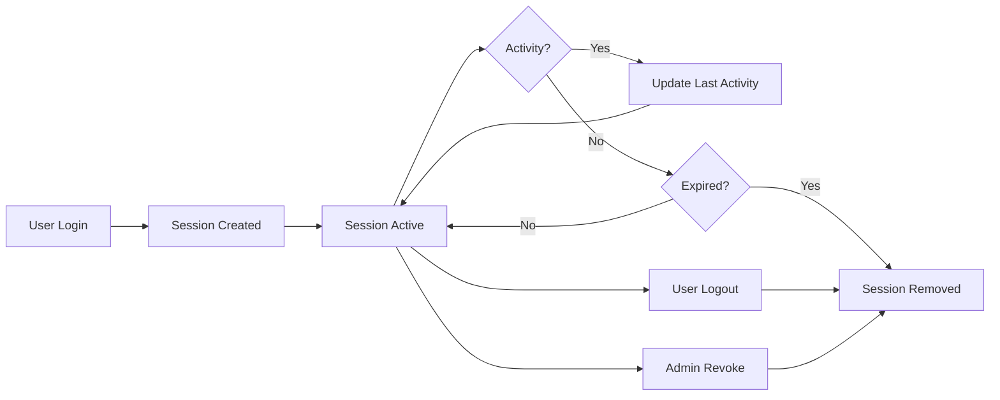

## Overview

The Sessions API provides endpoints for managing user authentication sessions. Sessions track active login instances across different devices and browsers, allowing users and administrators to monitor and control access.

## Get My Sessions

Retrieve all active sessions for the currently authenticated user.

<CodeGroup>
```bash cURL
curl -X GET https://api.example.com/api/v1/identity/sessions/me \
  -H "Authorization: Bearer {access_token}"
```

```csharp C#
var query = new GetMySessionsQuery();
var sessions = await mediator.Send(query);
```
</CodeGroup>

### HTTP Request

`GET /api/v1/identity/sessions/me`

### Authorization

Requires `Permissions.Sessions.View` permission.

### Response

Returns an array of `UserSessionDto` objects.

<ResponseField name="id" type="guid">
  Session's unique identifier
</ResponseField>

<ResponseField name="userId" type="string">
  User ID associated with the session
</ResponseField>

<ResponseField name="userName" type="string">
  Username of the session owner
</ResponseField>

<ResponseField name="userEmail" type="string">
  Email address of the session owner
</ResponseField>

<ResponseField name="ipAddress" type="string">
  IP address from which the session was created
</ResponseField>

<ResponseField name="deviceType" type="string">
  Type of device (e.g., Desktop, Mobile, Tablet)
</ResponseField>

<ResponseField name="browser" type="string">
  Browser name (e.g., Chrome, Firefox, Safari)
</ResponseField>

<ResponseField name="browserVersion" type="string">
  Browser version number
</ResponseField>

<ResponseField name="operatingSystem" type="string">
  Operating system name (e.g., Windows, macOS, Linux, iOS, Android)
</ResponseField>

<ResponseField name="osVersion" type="string">
  Operating system version
</ResponseField>

<ResponseField name="createdAt" type="datetime">
  Timestamp when the session was created
</ResponseField>

<ResponseField name="lastActivityAt" type="datetime">
  Timestamp of the last activity in this session
</ResponseField>

<ResponseField name="expiresAt" type="datetime">
  Timestamp when the session will expire
</ResponseField>

<ResponseField name="isActive" type="boolean">
  Whether the session is currently active
</ResponseField>

<ResponseField name="isCurrentSession" type="boolean">
  Whether this is the current session making the request
</ResponseField>

### Response Example

```json
[
  {
    "id": "3fa85f64-5717-4562-b3fc-2c963f66afa6",
    "userId": "user-id-123",
    "userName": "john.doe",
    "userEmail": "john.doe@example.com",
    "ipAddress": "192.168.1.100",
    "deviceType": "Desktop",
    "browser": "Chrome",
    "browserVersion": "122.0.0",
    "operatingSystem": "Windows",
    "osVersion": "11",
    "createdAt": "2026-03-06T09:00:00Z",
    "lastActivityAt": "2026-03-06T15:30:00Z",
    "expiresAt": "2026-03-07T09:00:00Z",
    "isActive": true,
    "isCurrentSession": true
  },
  {
    "id": "7b9c3d2a-8e5f-4a6b-9c7d-1e2f3a4b5c6d",
    "userId": "user-id-123",
    "userName": "john.doe",
    "userEmail": "john.doe@example.com",
    "ipAddress": "10.0.0.50",
    "deviceType": "Mobile",
    "browser": "Safari",
    "browserVersion": "17.2",
    "operatingSystem": "iOS",
    "osVersion": "17.3",
    "createdAt": "2026-03-05T14:20:00Z",
    "lastActivityAt": "2026-03-06T12:15:00Z",
    "expiresAt": "2026-03-06T14:20:00Z",
    "isActive": true,
    "isCurrentSession": false
  }
]
```

---

## Revoke Session

Revoke a specific session for the currently authenticated user.

<CodeGroup>
```bash cURL
curl -X DELETE https://api.example.com/api/v1/identity/sessions/{sessionId} \
  -H "Authorization: Bearer {access_token}"
```

```csharp C#
var command = new RevokeSessionCommand(sessionId);
var result = await mediator.Send(command);
```
</CodeGroup>

### HTTP Request

`DELETE /api/v1/identity/sessions/{sessionId}`

### Authorization

Requires `Permissions.Sessions.Revoke` permission.

### Path Parameters

<ParamField path="sessionId" type="guid" required>
  The unique identifier of the session to revoke
</ParamField>

### Response

Returns `200 OK` if the session was successfully revoked, or `404 Not Found` if the session doesn't exist or doesn't belong to the current user.

### Notes

- Users can only revoke their own sessions
- Revoking a session immediately invalidates the associated access and refresh tokens
- The current session (the one making the request) can be revoked, which will log out the user

---

## Revoke All Sessions

Revoke all active sessions for the currently authenticated user.

<CodeGroup>
```bash cURL
curl -X DELETE https://api.example.com/api/v1/identity/sessions \
  -H "Authorization: Bearer {access_token}"
```

```csharp C#
var command = new RevokeAllSessionsCommand();
await mediator.Send(command);
```
</CodeGroup>

### HTTP Request

`DELETE /api/v1/identity/sessions`

### Authorization

Requires `Permissions.Sessions.Revoke` permission.

### Response

Returns `200 OK` on successful revocation of all sessions.

### Notes

- This endpoint revokes ALL sessions for the current user, including the current session
- After calling this endpoint, the user will be logged out from all devices
- Useful for security purposes when a user suspects their account has been compromised

---

## Admin: Get User Sessions

Retrieve all active sessions for a specific user (admin operation).

<CodeGroup>
```bash cURL
curl -X GET https://api.example.com/api/v1/identity/users/{userId}/sessions \
  -H "Authorization: Bearer {access_token}"
```

```csharp C#
var query = new GetUserSessionsQuery(userId);
var sessions = await mediator.Send(query);
```
</CodeGroup>

### HTTP Request

`GET /api/v1/identity/users/{userId}/sessions`

### Authorization

Requires administrative permissions.

### Path Parameters

<ParamField path="userId" type="string" required>
  The unique identifier of the user
</ParamField>

### Response

Returns an array of `UserSessionDto` objects for the specified user.

---

## Admin: Revoke User Session

Revoke a specific session for any user (admin operation).

<CodeGroup>
```bash cURL
curl -X DELETE https://api.example.com/api/v1/identity/admin/sessions/{sessionId} \
  -H "Authorization: Bearer {access_token}"
```

```csharp C#
var command = new AdminRevokeSessionCommand(sessionId);
await mediator.Send(command);
```
</CodeGroup>

### HTTP Request

`DELETE /api/v1/identity/admin/sessions/{sessionId}`

### Authorization

Requires administrative permissions.

### Path Parameters

<ParamField path="sessionId" type="guid" required>
  The unique identifier of the session to revoke
</ParamField>

### Response

Returns `200 OK` on successful revocation.

---

## Admin: Revoke All User Sessions

Revoke all active sessions for a specific user (admin operation).

<CodeGroup>
```bash cURL
curl -X DELETE https://api.example.com/api/v1/identity/admin/users/{userId}/sessions \
  -H "Authorization: Bearer {access_token}"
```

```csharp C#
var command = new AdminRevokeAllSessionsCommand(userId);
await mediator.Send(command);
```
</CodeGroup>

### HTTP Request

`DELETE /api/v1/identity/admin/users/{userId}/sessions`

### Authorization

Requires administrative permissions.

### Path Parameters

<ParamField path="userId" type="string" required>
  The unique identifier of the user
</ParamField>

### Response

Returns `200 OK` on successful revocation of all user sessions.

---

## Session Management

### Automatic Cleanup

The system automatically cleans up expired sessions through a background service:

- Sessions are checked periodically for expiration
- Expired sessions are removed from the database
- This helps maintain optimal database performance

### Session Lifecycle



### Best Practices

<Tip>
  Regularly review active sessions and revoke any unrecognized sessions to maintain account security.
</Tip>

<Warning>
  Session expiration is enforced at both the token level and the session level. Expired refresh tokens cannot be used even if the session exists.
</Warning>

<Note>
  Sessions track device and browser information for security auditing purposes. This information is captured during login and stored with the session.
</Note>

---

## Security Considerations

### Multi-Device Support

- Users can have multiple active sessions across different devices
- Each session is independent and can be revoked individually
- Session IDs are unique and cannot be guessed or forged

### Session Revocation

- Revoking a session immediately invalidates associated tokens
- Users are notified (depending on configuration) when sessions are revoked
- Administrative session revocation is logged for audit purposes

### Token Rotation

- Refresh tokens are rotated on each use
- Old refresh tokens are invalidated immediately
- This prevents token replay attacks
