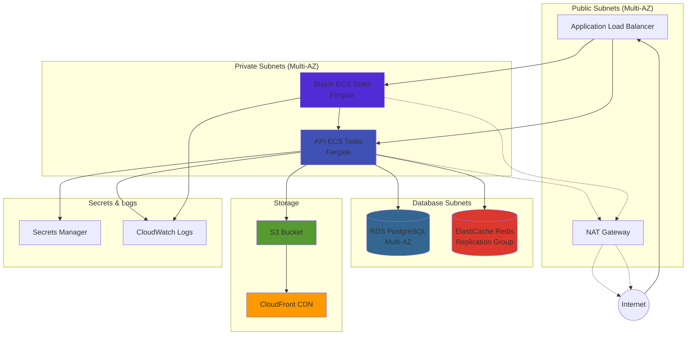

Deploy a production-ready infrastructure on AWS using the included Terraform modules. This guide covers the complete setup from bootstrapping state storage to deploying the application on ECS Fargate.

## Architecture Overview

The Terraform configuration provisions a complete, production-ready AWS infrastructure:



**Key Features:**
- **High Availability**: Multi-AZ deployment across all services
- **Scalability**: ECS auto-scaling, RDS storage auto-scaling
- **Security**: Private subnets, security groups, SSL/TLS encryption
- **Cost-Optimized**: Fargate Spot option, S3 lifecycle policies
- **Observability**: CloudWatch Logs, Container Insights, VPC Flow Logs

## Terraform Structure

The Terraform configuration follows a modular structure:

```bash
terraform/
├── bootstrap/                 # S3 backend for Terraform state
│   ├── main.tf
│   └── variables.tf
├── modules/                   # Reusable infrastructure modules
│   ├── network/              # VPC, subnets, NAT, VPC endpoints
│   ├── ecs_cluster/          # ECS cluster with Container Insights
│   ├── ecs_service/          # ECS Fargate service with ALB integration
│   ├── alb/                  # Application Load Balancer
│   ├── rds_postgres/         # RDS PostgreSQL with encryption
│   ├── elasticache_redis/    # Redis replication group
│   └── s3_bucket/            # S3 with CloudFront CDN
└── apps/
    └── playground/
        ├── app_stack/        # Main application stack (combines all modules)
        │   ├── main.tf
        │   ├── variables.tf
        │   └── outputs.tf
        └── envs/
            ├── dev/          # Development environment
            │   └── us-east-1/
            │       ├── main.tf
            │       ├── backend.tf
            │       ├── variables.tf
            │       └── terraform.tfvars
            ├── staging/      # Staging environment
            └── prod/         # Production environment
```

## Prerequisites

<Steps>
  <Step title="Install Tools">
    Install required tools:
    
    ```bash
    # Terraform (>= 1.14.0)
    brew install terraform
    # or
    wget https://releases.hashicorp.com/terraform/1.14.0/terraform_1.14.0_linux_amd64.zip
    
    # AWS CLI (>= 2.0)
    brew install awscli
    # or
    curl "https://awscli.amazonaws.com/awscli-exe-linux-x86_64.zip" -o "awscliv2.zip"
    unzip awscliv2.zip
    sudo ./aws/install
    
    # Verify installations
    terraform version  # Should be >= 1.14.0
    aws --version      # Should be >= 2.0
    ```
  </Step>

  <Step title="Configure AWS Credentials">
    Set up AWS credentials with appropriate permissions:
    
    ```bash
    aws configure
    ```
    
    Or use environment variables:
    ```bash
    export AWS_ACCESS_KEY_ID="your-access-key"
    export AWS_SECRET_ACCESS_KEY="your-secret-key"
    export AWS_DEFAULT_REGION="us-east-1"
    ```
    
    **Required IAM Permissions:**
    - VPC management (create/modify VPCs, subnets, security groups)
    - ECS management (clusters, services, task definitions)
    - RDS management (instances, subnet groups, parameter groups)
    - ElastiCache management (replication groups, subnet groups)
    - S3 management (buckets, policies)
    - Secrets Manager (create/read secrets)
    - CloudWatch Logs (create log groups)
    - IAM (create roles, policies, attach policies)
  </Step>

  <Step title="Build Container Images">
    Build and push container images to a registry (ECR, GHCR, Docker Hub):
    
    <Tabs>
      <Tab title="GitHub Container Registry">
        ```bash
        # Build images
        dotnet publish src/Playground/Playground.Api/Playground.Api.csproj \
          -c Release -r linux-x64 -p:PublishProfile=DefaultContainer \
          -p:ContainerRepository=ghcr.io/yourorg/fsh-playground-api \
          -p:ContainerImageTags='"1.0.0"'
        
        dotnet publish src/Playground/Playground.Blazor/Playground.Blazor.csproj \
          -c Release -r linux-x64 -p:PublishProfile=DefaultContainer \
          -p:ContainerRepository=ghcr.io/yourorg/fsh-playground-blazor \
          -p:ContainerImageTags='"1.0.0"'
        
        # Push to GHCR
        echo $GITHUB_TOKEN | docker login ghcr.io -u youruser --password-stdin
        docker push ghcr.io/yourorg/fsh-playground-api:1.0.0
        docker push ghcr.io/yourorg/fsh-playground-blazor:1.0.0
        ```
      </Tab>
      
      <Tab title="Amazon ECR">
        ```bash
        # Create ECR repositories
        aws ecr create-repository --repository-name fsh-playground-api --region us-east-1
        aws ecr create-repository --repository-name fsh-playground-blazor --region us-east-1
        
        # Authenticate to ECR
        aws ecr get-login-password --region us-east-1 | \
          docker login --username AWS --password-stdin 123456789012.dkr.ecr.us-east-1.amazonaws.com
        
        # Build and push
        dotnet publish src/Playground/Playground.Api/Playground.Api.csproj \
          -c Release -r linux-x64 -p:PublishProfile=DefaultContainer \
          -p:ContainerRepository=123456789012.dkr.ecr.us-east-1.amazonaws.com/fsh-playground-api \
          -p:ContainerImageTags='"1.0.0"'
        
        docker push 123456789012.dkr.ecr.us-east-1.amazonaws.com/fsh-playground-api:1.0.0
        # Repeat for Blazor
        ```
      </Tab>
    </Tabs>
  </Step>
</Steps>

## Bootstrap Terraform State

Terraform stores state in S3 with native file locking (Terraform 1.10+). No DynamoDB required.

<Steps>
  <Step title="Navigate to Bootstrap Directory">
    ```bash
    cd terraform/bootstrap
    ```
  </Step>

  <Step title="Create terraform.tfvars">
    ```hcl terraform.tfvars
    region      = "us-east-1"
    bucket_name = "fsh-terraform-state-prod"  # Must be globally unique
    
    # Optional: KMS encryption
    # kms_key_arn = "arn:aws:kms:us-east-1:123456789012:key/..."
    
    # State version retention (days)
    state_version_retention_days = 90
    ```
  </Step>

  <Step title="Initialize and Apply">
    ```bash
    terraform init
    terraform plan
    terraform apply
    ```
    
    Output:
    ```bash
    state_bucket_name = "fsh-terraform-state-prod"
    backend_config_hcl = <<EOT
    terraform {
      backend "s3" {
        bucket       = "fsh-terraform-state-prod"
        key          = "<environment>/<region>/terraform.tfstate"
        region       = "us-east-1"
        encrypt      = true
        use_lockfile = true
      }
    }
    EOT
    ```
  </Step>
</Steps>

<Note>
  The S3 bucket has `prevent_destroy = true` lifecycle rule to prevent accidental deletion. Versioning is enabled for state recovery.
</Note>

## Deploy Application Infrastructure

### Development Environment

<Steps>
  <Step title="Navigate to Environment Directory">
    ```bash
    cd terraform/apps/playground/envs/dev/us-east-1
    ```
  </Step>

  <Step title="Configure Backend">
    The `backend.tf` file is already configured:
    
    ```hcl backend.tf
    terraform {
      backend "s3" {
        bucket       = "fsh-terraform-state-prod"
        key          = "dev/us-east-1/terraform.tfstate"
        region       = "us-east-1"
        encrypt      = true
        use_lockfile = true
      }
    }
    ```
  </Step>

  <Step title="Create terraform.tfvars">
    ```hcl terraform.tfvars
    # General
    environment = "dev"
    region      = "us-east-1"
    domain_name = null  # Set to your domain if using custom domain
    
    # Network
    vpc_cidr_block = "10.0.0.0/16"
    public_subnets = {
      public-1 = { cidr_block = "10.0.1.0/24", az = "us-east-1a" }
      public-2 = { cidr_block = "10.0.2.0/24", az = "us-east-1b" }
    }
    private_subnets = {
      private-1 = { cidr_block = "10.0.11.0/24", az = "us-east-1a" }
      private-2 = { cidr_block = "10.0.12.0/24", az = "us-east-1b" }
    }
    
    # Cost optimization for dev
    enable_nat_gateway         = true
    single_nat_gateway         = true   # Single NAT for cost savings
    enable_s3_endpoint         = true
    enable_ecr_endpoints       = true
    enable_logs_endpoint       = true
    enable_container_insights  = true
    
    # ALB
    enable_https               = false  # Set to true if you have ACM cert
    acm_certificate_arn        = null
    
    # S3
    app_s3_bucket_name         = "fsh-dev-app-data-12345"  # Must be globally unique
    app_s3_enable_cloudfront   = false  # Enable for production
    
    # Database
    db_name                    = "fsh"
    db_username                = "postgres"
    db_password                = null   # Leave null to use AWS-managed password
    db_manage_master_user_password = true  # AWS manages password in Secrets Manager
    db_instance_class          = "db.t3.micro"
    db_allocated_storage       = 20
    db_multi_az                = false  # Enable for production
    db_deletion_protection     = false
    
    # Redis
    redis_node_type                  = "cache.t3.micro"
    redis_num_cache_clusters         = 1
    redis_automatic_failover_enabled = false
    
    # Container Images
    container_registry  = "ghcr.io/yourorg"
    container_image_tag = "1.0.0"
    api_image_name      = "fsh-playground-api"
    blazor_image_name   = "fsh-playground-blazor"
    
    # ECS Services
    api_cpu           = "256"
    api_memory        = "512"
    api_desired_count = 1
    
    blazor_cpu           = "256"
    blazor_memory        = "512"
    blazor_desired_count = 1
    ```
  </Step>

  <Step title="Initialize Terraform">
    ```bash
    terraform init
    ```
    
    This downloads required providers and configures the S3 backend.
  </Step>

  <Step title="Review Plan">
    ```bash
    terraform plan
    ```
    
    Review the resources that will be created:
    - 1 VPC with 4 subnets (2 public, 2 private)
    - 1 NAT Gateway
    - 1 Application Load Balancer
    - 1 ECS Cluster
    - 2 ECS Services (API + Blazor)
    - 1 RDS PostgreSQL instance
    - 1 ElastiCache Redis replication group
    - 1 S3 bucket
    - Security groups, IAM roles, CloudWatch log groups
  </Step>

  <Step title="Apply Configuration">
    ```bash
    terraform apply
    ```
    
    Type `yes` to confirm. Deployment takes **10-15 minutes**.
  </Step>

  <Step title="Retrieve Outputs">
    ```bash
    terraform output
    ```
    
    Important outputs:
    ```hcl
    alb_dns_name      = "dev-us-east-1-alb-1234567890.us-east-1.elb.amazonaws.com"
    api_url           = "http://dev-us-east-1-alb-1234567890.us-east-1.elb.amazonaws.com"
    blazor_url        = "http://dev-us-east-1-alb-1234567890.us-east-1.elb.amazonaws.com"
    rds_endpoint      = "dev-us-east-1-postgres.c1234567890.us-east-1.rds.amazonaws.com:5432"
    rds_secret_arn    = "arn:aws:secretsmanager:us-east-1:123456789012:secret:..."
    redis_endpoint    = "dev-us-east-1-redis.abc123.0001.use1.cache.amazonaws.com:6379"
    s3_bucket_name    = "fsh-dev-app-data-12345"
    ```
  </Step>
</Steps>

### Production Environment

For production, enable high availability and enhanced monitoring:

```hcl terraform/apps/playground/envs/prod/us-east-1/terraform.tfvars
# General
environment = "prod"
region      = "us-east-1"
domain_name = "app.yourcompany.com"

# Network (larger address space)
vpc_cidr_block = "10.1.0.0/16"
public_subnets = {
  public-1 = { cidr_block = "10.1.1.0/24", az = "us-east-1a" }
  public-2 = { cidr_block = "10.1.2.0/24", az = "us-east-1b" }
  public-3 = { cidr_block = "10.1.3.0/24", az = "us-east-1c" }
}
private_subnets = {
  private-1 = { cidr_block = "10.1.11.0/24", az = "us-east-1a" }
  private-2 = { cidr_block = "10.1.12.0/24", az = "us-east-1b" }
  private-3 = { cidr_block = "10.1.13.0/24", az = "us-east-1c" }
}

# High Availability
single_nat_gateway                = false  # NAT Gateway per AZ
enable_flow_logs                  = true
flow_logs_retention_days          = 30
enable_container_insights         = true

# HTTPS with ACM certificate
enable_https                      = true
acm_certificate_arn               = "arn:aws:acm:us-east-1:123456789012:certificate/..."
alb_enable_deletion_protection    = true

# S3 with CloudFront
app_s3_bucket_name                = "fsh-prod-app-data-12345"
app_s3_versioning_enabled         = true
app_s3_enable_cloudfront          = true
app_s3_cloudfront_price_class     = "PriceClass_100"
app_s3_enable_intelligent_tiering = true

# Database - Production Configuration
db_instance_class                 = "db.t3.medium"
db_allocated_storage              = 50
db_max_allocated_storage          = 500
db_multi_az                       = true   # High availability
db_backup_retention_period        = 30
db_deletion_protection            = true
db_enable_performance_insights    = true
db_enable_enhanced_monitoring     = true
db_manage_master_user_password    = true

# Redis - Production Configuration
redis_node_type                   = "cache.t3.small"
redis_num_cache_clusters          = 2      # Multi-node for failover
redis_automatic_failover_enabled  = true

# Container Images
container_registry  = "ghcr.io/yourorg"
container_image_tag = "1.0.0"

# ECS Services - Production Sizing
api_cpu                    = "512"
api_memory                 = "1024"
api_desired_count          = 2     # Minimum 2 for HA
api_enable_circuit_breaker = true
api_use_fargate_spot       = false # Use on-demand for production

blazor_cpu                    = "512"
blazor_memory                 = "1024"
blazor_desired_count          = 2
blazor_enable_circuit_breaker = true
blazor_use_fargate_spot       = false
```

Deploy:
```bash
cd terraform/apps/playground/envs/prod/us-east-1
terraform init
terraform plan
terraform apply
```

## Infrastructure Modules

### Network Module

Creates VPC with public/private subnets, NAT Gateway, and VPC endpoints:

```hcl terraform/apps/playground/envs/dev/us-east-1/main.tf
module "network" {
  source = "../../../modules/network"
  
  name       = "dev-us-east-1"
  cidr_block = "10.0.0.0/16"
  
  public_subnets  = var.public_subnets
  private_subnets = var.private_subnets
  
  enable_nat_gateway = true
  single_nat_gateway = true  # Cost savings for dev
  
  # VPC Endpoints (reduce NAT Gateway costs)
  enable_s3_endpoint             = true   # Gateway endpoint (free)
  enable_ecr_endpoints           = true   # Interface endpoints
  enable_logs_endpoint           = true
  enable_secretsmanager_endpoint = true
  
  tags = local.common_tags
}
```

**Features:**
- Multi-AZ support for high availability
- VPC endpoints reduce NAT Gateway data transfer costs
- VPC Flow Logs for network monitoring (optional)
- Automatic route table configuration

### ECS Service Module

Deploys a Fargate service with ALB integration:

```hcl terraform/apps/playground/app_stack/main.tf
module "api_service" {
  source = "../../../modules/ecs_service"
  
  name            = "dev-api"
  cluster_arn     = module.ecs_cluster.arn
  container_image = "ghcr.io/yourorg/fsh-playground-api:1.0.0"
  container_port  = 8080
  
  cpu            = "256"
  memory         = "512"
  desired_count  = 1
  
  vpc_id         = module.network.vpc_id
  subnet_ids     = module.network.private_subnet_ids
  
  # ALB Configuration
  listener_arn           = module.alb.https_listener_arn
  listener_rule_priority = 10
  path_patterns          = ["/api/*", "/health*", "/swagger*"]
  
  # Health Checks
  health_check_path = "/health/live"
  
  # Environment Variables
  environment_variables = {
    ASPNETCORE_ENVIRONMENT = "Production"
    CachingOptions__Redis  = module.redis.connection_string
    Storage__Provider      = "s3"
    Storage__S3__Bucket    = var.app_s3_bucket_name
  }
  
  # Secrets from Secrets Manager
  secrets = [
    {
      name      = "DatabaseOptions__ConnectionString"
      valueFrom = aws_secretsmanager_secret.db_connection_string.arn
    }
  ]
  
  # IAM Role for S3 access
  task_role_arn = aws_iam_role.api_task.arn
  
  tags = local.common_tags
}
```

**Features:**
- Fargate launch type (serverless containers)
- Fargate Spot support for 70% cost savings
- ALB target group with health checks
- CloudWatch Logs integration
- IAM roles for task and execution
- Secrets injection from Secrets Manager

### RDS PostgreSQL Module

```hcl terraform/apps/playground/app_stack/main.tf
module "rds" {
  source = "../../../modules/rds_postgres"
  
  name       = "dev-us-east-1-postgres"
  vpc_id     = module.network.vpc_id
  subnet_ids = module.network.private_subnet_ids
  
  # Allow access from ECS services
  allowed_cidr_blocks = [var.vpc_cidr_block]
  
  db_name  = "fsh"
  username = "postgres"
  
  # AWS-managed password in Secrets Manager
  manage_master_user_password = true
  
  instance_class        = "db.t3.micro"
  allocated_storage     = 20
  max_allocated_storage = 100  # Auto-scaling
  engine_version        = "16"
  
  multi_az                    = false  # Enable for prod
  backup_retention_period     = 7
  deletion_protection         = false
  skip_final_snapshot         = true   # For dev only
  
  performance_insights_enabled = false
  monitoring_interval          = 0
  
  tags = local.common_tags
}
```

**Features:**
- PostgreSQL 16 engine
- AWS-managed passwords (stored in Secrets Manager)
- Storage auto-scaling (20 GB → 100 GB default)
- Multi-AZ for high availability (production)
- Automated backups with configurable retention
- Performance Insights and Enhanced Monitoring (optional)
- Encryption at rest (default)

### ElastiCache Redis Module

```hcl terraform/apps/playground/app_stack/main.tf
module "redis" {
  source = "../../../modules/elasticache_redis"
  
  name       = "dev-us-east-1-redis"
  vpc_id     = module.network.vpc_id
  subnet_ids = module.network.private_subnet_ids
  
  allowed_cidr_blocks = [var.vpc_cidr_block]
  
  node_type                  = "cache.t3.micro"
  num_cache_clusters         = 1
  engine_version             = "7.1"
  automatic_failover_enabled = false
  transit_encryption_enabled = true
  
  tags = local.common_tags
}
```

**Features:**
- Redis 7.1 engine
- Replication group with automatic failover (production)
- In-transit encryption enabled
- Subnet group in private subnets
- Outputs connection string for application

### S3 Bucket with CloudFront

```hcl terraform/apps/playground/app_stack/main.tf
module "app_s3" {
  source = "../../../modules/s3_bucket"
  
  name               = var.app_s3_bucket_name
  versioning_enabled = true
  force_destroy      = false  # Prevent accidental deletion
  
  # CloudFront CDN
  enable_cloudfront          = true
  cloudfront_price_class     = "PriceClass_100"  # US + EU
  
  # Lifecycle policies
  enable_intelligent_tiering = true
  lifecycle_rules = [
    {
      id      = "delete-old-versions"
      enabled = true
      noncurrent_version_expiration_days = 90
    }
  ]
  
  # CORS for API access
  cors_rules = [
    {
      allowed_methods = ["GET", "PUT", "POST"]
      allowed_origins = ["https://app.yourcompany.com"]
      allowed_headers = ["*"]
      expose_headers  = ["ETag"]
      max_age_seconds = 3600
    }
  ]
  
  tags = local.common_tags
}
```

**Features:**
- Versioning for file recovery
- CloudFront CDN for global delivery
- Lifecycle policies for cost optimization
- Intelligent tiering for automatic cost savings
- CORS configuration for API access
- Public access block enabled by default

## Post-Deployment Configuration

<Steps>
  <Step title="Verify Deployment">
    Check that services are running:
    
    ```bash
    # Get ALB DNS name
    ALB_DNS=$(terraform output -raw alb_dns_name)
    
    # Test API health
    curl http://$ALB_DNS/health/live
    # Expected: {"status":"Healthy"}
    
    # Access Blazor UI
    open http://$ALB_DNS
    ```
  </Step>

  <Step title="Configure DNS (Optional)">
    If using a custom domain, create a Route53 alias record:
    
    ```hcl
    resource "aws_route53_record" "app" {
      zone_id = data.aws_route53_zone.main.zone_id
      name    = "app.yourcompany.com"
      type    = "A"
      
      alias {
        name                   = module.app.alb_dns_name
        zone_id                = module.app.alb_zone_id
        evaluate_target_health = true
      }
    }
    ```
  </Step>

  <Step title="Retrieve Database Password">
    If using AWS-managed passwords:
    
    ```bash
    # Get secret ARN
    SECRET_ARN=$(terraform output -raw rds_secret_arn)
    
    # Retrieve connection string
    aws secretsmanager get-secret-value \
      --secret-id $SECRET_ARN \
      --query SecretString \
      --output text
    ```
    
    The connection string is automatically injected into ECS tasks via the `secrets` configuration.
  </Step>

  <Step title="Monitor Logs">
    View application logs in CloudWatch:
    
    ```bash
    # API logs
    aws logs tail /ecs/dev-api --follow
    
    # Blazor logs
    aws logs tail /ecs/dev-blazor --follow
    ```
    
    Or use the AWS Console:
    - CloudWatch → Log groups → `/ecs/dev-api`
    - ECS → Clusters → dev-us-east-1-cluster → Services → dev-api → Logs
  </Step>

  <Step title="Access Hangfire Dashboard">
    The Hangfire dashboard is available at:
    
    ```bash
    http://$ALB_DNS/jobs
    ```
    
    Default credentials are in `appsettings.json`. **Change them for production** via environment variables:
    
    ```hcl
    environment_variables = {
      HangfireOptions__Username = "admin"
      HangfireOptions__Password = "<from-secrets-manager>"
    }
    ```
  </Step>
</Steps>

## Auto-Scaling Configuration

Add auto-scaling policies for ECS services:

```hcl auto-scaling.tf
# API Service Auto-Scaling
resource "aws_appautoscaling_target" "api" {
  max_capacity       = 10
  min_capacity       = 2
  resource_id        = "service/${module.ecs_cluster.name}/${module.api_service.name}"
  scalable_dimension = "ecs:service:DesiredCount"
  service_namespace  = "ecs"
}

resource "aws_appautoscaling_policy" "api_cpu" {
  name               = "api-cpu-scaling"
  policy_type        = "TargetTrackingScaling"
  resource_id        = aws_appautoscaling_target.api.resource_id
  scalable_dimension = aws_appautoscaling_target.api.scalable_dimension
  service_namespace  = aws_appautoscaling_target.api.service_namespace
  
  target_tracking_scaling_policy_configuration {
    target_value       = 70.0
    predefined_metric_specification {
      predefined_metric_type = "ECSServiceAverageCPUUtilization"
    }
    scale_in_cooldown  = 300
    scale_out_cooldown = 60
  }
}

resource "aws_appautoscaling_policy" "api_memory" {
  name               = "api-memory-scaling"
  policy_type        = "TargetTrackingScaling"
  resource_id        = aws_appautoscaling_target.api.resource_id
  scalable_dimension = aws_appautoscaling_target.api.scalable_dimension
  service_namespace  = aws_appautoscaling_target.api.service_namespace
  
  target_tracking_scaling_policy_configuration {
    target_value       = 80.0
    predefined_metric_specification {
      predefined_metric_type = "ECSServiceAverageMemoryUtilization"
    }
    scale_in_cooldown  = 300
    scale_out_cooldown = 60
  }
}
```

## Cost Optimization

<CardGroup cols={2}>
  <Card title="Fargate Spot" icon="dollar-sign">
    Save 70% on compute costs with Fargate Spot:
    
    ```hcl
    api_use_fargate_spot = true
    ```
    
    AWS handles interruptions gracefully. Best for stateless workloads.
  </Card>
  
  <Card title="Single NAT Gateway" icon="network-wired">
    Use one NAT Gateway for dev environments:
    
    ```hcl
    single_nat_gateway = true  # ~$32/month savings
    ```
    
    Production: use one NAT per AZ for high availability.
  </Card>
  
  <Card title="VPC Endpoints" icon="arrows-rotate">
    Reduce NAT Gateway data transfer costs:
    
    ```hcl
    enable_s3_endpoint = true      # Free (Gateway endpoint)
    enable_ecr_endpoints = true    # ~$7/month per endpoint
    enable_logs_endpoint = true
    ```
    
    Trade-off: endpoint cost vs. NAT data transfer savings.
  </Card>
  
  <Card title="S3 Intelligent Tiering" icon="box-archive">
    Automatic cost savings for infrequently accessed files:
    
    ```hcl
    app_s3_enable_intelligent_tiering = true
    ```
    
    Moves objects to lower-cost tiers automatically.
  </Card>
</CardGroup>

**Estimated Monthly Costs (us-east-1, dev environment):**
- ECS Fargate (2 tasks, 0.25 vCPU, 0.5 GB): ~$15-20
- RDS db.t3.micro (single-AZ): ~$15
- ElastiCache cache.t3.micro: ~$12
- NAT Gateway (single): ~$32 + data transfer
- ALB: ~$16 + data transfer
- S3 + CloudFront: ~$5-10

**Total: ~$100-110/month** for a complete dev environment.

Production (Multi-AZ, larger instances): ~$300-500/month.

## Teardown

To destroy infrastructure:

<Warning>
  **This deletes all resources including databases and S3 data.** Ensure you have backups before proceeding.
</Warning>

```bash
cd terraform/apps/playground/envs/dev/us-east-1

# Preview destruction
terraform plan -destroy

# Destroy infrastructure
terraform destroy
```

For production environments with `deletion_protection = true`, you must first disable protection:

```bash
# Disable RDS deletion protection
terraform apply -var="db_deletion_protection=false"

# Then destroy
terraform destroy
```

## Troubleshooting

<AccordionGroup>
  <Accordion title="ECS tasks fail to start">
    **Cause**: Unable to pull container images from registry.
    
    **Debug**:
    ```bash
    aws ecs describe-tasks --cluster dev-us-east-1-cluster --tasks <task-arn>
    ```
    
    **Common issues**:
    - ECR authentication failure: Ensure ECS task execution role has ECR permissions
    - Image not found: Verify `container_registry` and `container_image_tag` variables
    - GHCR authentication: Make images public or add GHCR credentials to Secrets Manager
  </Accordion>

  <Accordion title="Database connection errors">
    **Error**: `Could not connect to server`
    
    **Debug**:
    ```bash
    # Check RDS endpoint
    terraform output rds_endpoint
    
    # Verify security groups allow ECS → RDS traffic
    aws ec2 describe-security-groups --group-ids <rds-sg-id>
    ```
    
    **Solution**: Security groups are configured automatically to allow VPC CIDR access. Check if VPC CIDR is correct.
  </Accordion>

  <Accordion title="ALB returns 503 Service Unavailable">
    **Cause**: Target group has no healthy targets.
    
    **Debug**:
    ```bash
    aws elbv2 describe-target-health --target-group-arn <tg-arn>
    ```
    
    **Common issues**:
    - Health check path incorrect: Ensure `/health/live` endpoint exists
    - Application startup failure: Check CloudWatch Logs for errors
    - Database migration failure: Verify connection string in ECS task
  </Accordion>

  <Accordion title="Terraform state lock errors">
    **Error**: `Error acquiring the state lock`
    
    **Cause**: Previous Terraform operation was interrupted.
    
    **Solution**: Wait for lock to expire, or force unlock:
    ```bash
    terraform force-unlock <lock-id>
    ```
    
    With S3 native locking (Terraform 1.10+), locks are stored as S3 object versions and expire automatically.
  </Accordion>
</AccordionGroup>

## Next Steps

<CardGroup cols={2}>
  <Card title="Configuration Management" icon="gear" href="/deployment/configuration-management">
    Learn how to manage secrets, environment variables, and configuration hierarchies
  </Card>
  
  <Card title="CI/CD Pipeline" icon="code-branch">
    Set up GitHub Actions to automate Terraform deployments
  </Card>
  
  <Card title="Monitoring & Alerts" icon="chart-line">
    Configure CloudWatch alarms for critical metrics
  </Card>
  
  <Card title="Deployment Overview" icon="rocket" href="/deployment/overview">
    Review production best practices and deployment checklist
  </Card>
</CardGroup>
