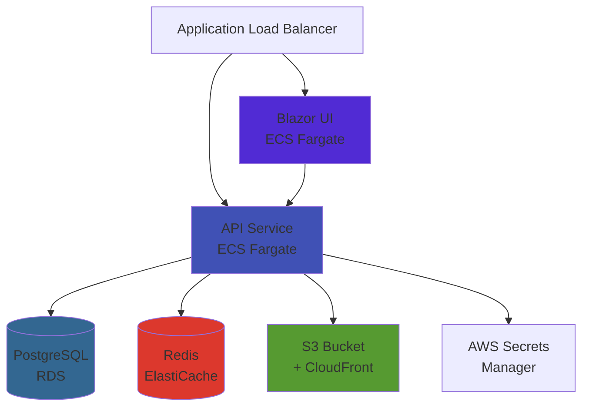

The FullStackHero .NET Starter Kit is built for production from day one. This guide covers deployment options, infrastructure requirements, and best practices for running your application in production.

## Deployment Options

The starter kit supports multiple deployment strategies to fit your infrastructure needs:

<CardGroup cols={2}>
  <Card title="AWS ECS Fargate" icon="aws" href="/deployment/aws">
    Serverless containers with full Terraform automation for VPC, RDS, Redis, and S3
  </Card>
  <Card title="Docker Compose" icon="docker" href="/deployment/docker">
    Self-hosted deployment using Docker containers for development and small production workloads
  </Card>
  <Card title="Azure Container Apps" icon="microsoft">
    Coming soon - serverless containers on Azure with managed Postgres and Redis
  </Card>
  <Card title="Kubernetes" icon="kubernetes">
    Coming soon - production-grade orchestration with Helm charts
  </Card>
</CardGroup>

## Architecture Components

A production deployment consists of these key components:



### Core Services

<AccordionGroup>
  <Accordion title="API Service" icon="server">
    **Playground.Api** - The main ASP.NET Core API
    
    - **Runtime**: .NET 10 on Linux (x64)
    - **Port**: 8080 (containerized)
    - **Routes**: `/api/*`, `/health/*`, `/swagger/*`, `/scalar*`
    - **Resources**: 256 CPU units, 512 MB memory (configurable)
    - **Scaling**: Horizontal auto-scaling based on CPU/memory
    - **Health Checks**: `/health/live` and `/health/ready` endpoints
  </Accordion>

  <Accordion title="Blazor UI" icon="browser">
    **Playground.Blazor** - The Blazor WebAssembly/Server UI
    
    - **Runtime**: .NET 10 on Linux (x64)
    - **Port**: 8080 (containerized)
    - **Routes**: `/*` (catch-all, lower priority than API)
    - **Resources**: 256 CPU units, 512 MB memory (configurable)
    - **Scaling**: Horizontal auto-scaling
  </Accordion>

  <Accordion title="PostgreSQL Database" icon="database">
    **Primary Data Store** - Handles all application data and multi-tenancy
    
    - **Engine**: PostgreSQL 16
    - **Multi-Tenancy**: Finbuckle-powered with shared database, tenant isolation
    - **Migrations**: EF Core migrations via `Migrations.PostgreSQL` project
    - **Connection**: SSL/TLS required, pooling enabled
    - **Backup**: Automated backups with configurable retention (default 7 days)
  </Accordion>

  <Accordion title="Redis Cache" icon="memory">
    **Distributed Caching** - Session storage and distributed locking
    
    - **Engine**: Redis 7.1
    - **Configuration**: ElastiCache replication group with automatic failover
    - **Encryption**: In-transit encryption enabled
    - **Use Cases**: Distributed cache, rate limiting, Hangfire job storage
  </Accordion>

  <Accordion title="S3 Storage" icon="folder">
    **File Storage** - User uploads, profile images, and application assets
    
    - **Provider**: AWS S3 with optional CloudFront CDN
    - **Structure**: Tenant-isolated paths with public/private prefixes
    - **Features**: Versioning, lifecycle policies, intelligent tiering
    - **Integration**: IAM role-based access from ECS tasks
  </Accordion>
</AccordionGroup>

## Production Considerations

### Security

<Steps>
  <Step title="Secrets Management">
    Never store secrets in `appsettings.json` or environment variables directly.
    
    **AWS Deployment:**
    - Database passwords managed by AWS Secrets Manager
    - Connection strings injected via ECS secrets
    - JWT signing keys stored in Secrets Manager
    
    **Docker Deployment:**
    - Use Docker secrets or external secret stores
    - Mount secrets as files, not environment variables
    
    See [Configuration Management](/deployment/configuration-management) for details.
  </Step>

  <Step title="Network Security">
    **VPC Configuration:**
    - API and Blazor services run in private subnets
    - Only ALB is publicly accessible
    - Database and Redis in isolated subnets
    - Security groups restrict traffic between services
    
    **TLS/SSL:**
    - HTTPS enforced at ALB level (ACM certificate required)
    - Database connections use SSL Mode=Require
    - Redis transit encryption enabled
  </Step>

  <Step title="Identity & Authentication">
    **JWT Configuration:**
    ```json
    {
      "JwtOptions": {
        "Issuer": "your-domain.com",
        "Audience": "your-app-clients",
        "SigningKey": "<from-secrets-manager>",
        "AccessTokenMinutes": 60,
        "RefreshTokenDays": 7
      }
    }
    ```
    
    - Generate strong signing keys (min 32 characters)
    - Store in Secrets Manager, never in source control
    - Use shorter access token lifetimes (15-60 minutes)
    - Implement refresh token rotation
  </Step>

  <Step title="CORS & Origins">
    Configure allowed origins explicitly:
    
    ```json
    {
      "CorsOptions": {
        "AllowAll": false,
        "AllowedOrigins": [
          "https://app.yourcompany.com",
          "https://admin.yourcompany.com"
        ]
      },
      "OriginOptions": {
        "OriginUrl": "https://app.yourcompany.com"
      }
    }
    ```
  </Step>
</Steps>

### Performance & Scalability

<Tabs>
  <Tab title="Caching Strategy">
    **Redis Configuration:**
    ```json
    {
      "CachingOptions": {
        "Redis": "your-redis-endpoint.cache.amazonaws.com:6379,ssl=true"
      }
    }
    ```
    
    **Caching Patterns:**
    - User sessions and authentication tokens
    - Frequently accessed tenant configurations
    - API response caching for read-heavy endpoints
    - Rate limiting counters
    
    **Production Settings:**
    - Enable automatic failover (multi-node setup)
    - Configure appropriate eviction policies
    - Monitor memory usage and hit rates
  </Tab>

  <Tab title="Database Optimization">
    **Connection Pooling:**
    ```csharp
    "ConnectionString": "Host=...;Database=...;Username=...;Password=...;Pooling=true;Minimum Pool Size=2;Maximum Pool Size=100;"
    ```
    
    **Performance Features:**
    - Enable RDS Performance Insights
    - Configure read replicas for read-heavy workloads
    - Use Multi-AZ for high availability
    - Set appropriate backup retention (7-30 days)
    
    **Monitoring:**
    - Track query performance via EF Core logging
    - Monitor connection pool exhaustion
    - Review slow query logs regularly
  </Tab>

  <Tab title="Auto-Scaling">
    **ECS Service Scaling:**
    - **Target CPU**: 70% utilization
    - **Target Memory**: 80% utilization
    - **Min Tasks**: 2 (for high availability)
    - **Max Tasks**: 10+ (based on load)
    
    **Fargate Spot:**
    ```hcl
    api_use_fargate_spot = true  # 70% cost savings
    ```
    
    Use Fargate Spot for non-critical workloads. Fargate handles interruptions gracefully.
    
    **Database Scaling:**
    - Enable storage auto-scaling (20 GB → 100 GB default)
    - Vertical scaling: upgrade instance class during maintenance windows
    - Read replicas for read-heavy workloads
  </Tab>

  <Tab title="CDN & Static Assets">
    **CloudFront Configuration:**
    - S3 bucket origin with OAI (Origin Access Identity)
    - Cache static assets with long TTL (1 year)
    - Compress responses automatically
    - Price class: US/EU regions (PriceClass_100)
    
    **Storage Configuration:**
    ```json
    {
      "Storage": {
        "Provider": "s3",
        "S3": {
          "Bucket": "your-app-bucket",
          "PublicBaseUrl": "https://d1234567890.cloudfront.net"
        }
      }
    }
    ```
  </Tab>
</Tabs>

### Observability

<Note>
  The starter kit includes built-in OpenTelemetry instrumentation for traces, metrics, and logs.
</Note>

**OpenTelemetry Configuration:**
```json
{
  "OpenTelemetryOptions": {
    "Enabled": true,
    "Tracing": { "Enabled": true },
    "Metrics": { "Enabled": true },
    "Exporter": {
      "Otlp": {
        "Enabled": true,
        "Endpoint": "https://your-otlp-collector:4317",
        "Protocol": "grpc"
      }
    }
  }
}
```

**Monitoring Stack Options:**
- **AWS**: CloudWatch Logs + Container Insights + X-Ray
- **Self-Hosted**: Jaeger (traces) + Prometheus (metrics) + Grafana (dashboards)
- **Commercial**: Datadog, New Relic, Honeycomb, Grafana Cloud

**Key Metrics to Monitor:**
- Request latency (p50, p95, p99)
- Error rates (4xx, 5xx responses)
- Database connection pool usage
- Redis cache hit rates
- ECS CPU and memory utilization
- RDS IOPS and storage capacity

### High Availability

<CardGroup cols={2}>
  <Card title="Multi-AZ Deployment" icon="globe">
    - Deploy API and Blazor across multiple availability zones
    - Use Multi-AZ RDS for automatic failover
    - Redis replication group with automatic failover
    - ALB distributes traffic across zones
  </Card>
  
  <Card title="Health Checks" icon="heart-pulse">
    **Liveness**: `/health/live` (pod restart trigger)
    
    **Readiness**: `/health/ready` (load balancer routing)
    
    Configure appropriate thresholds (2/3 healthy checks)
  </Card>
  
  <Card title="Circuit Breakers" icon="shield">
    ECS deployment circuit breaker automatically rolls back failed deployments
    
    ```hcl
    enable_circuit_breaker = true
    enable_circuit_breaker_rollback = true
    ```
  </Card>
  
  <Card title="Backup & Recovery" icon="clock-rotate-left">
    - Automated RDS snapshots (7-30 day retention)
    - S3 versioning for file recovery
    - Point-in-time recovery for databases
    - Document recovery procedures
  </Card>
</CardGroup>

## Environment Configuration

The application supports environment-specific configuration via the standard ASP.NET Core hierarchy:

```bash
appsettings.json                 # Base configuration (shared)
appsettings.Development.json     # Dev overrides (ASPNETCORE_ENVIRONMENT=Development)
appsettings.Production.json      # Prod overrides (ASPNETCORE_ENVIRONMENT=Production)
Environment Variables            # Highest priority (use for secrets)
AWS Secrets Manager              # Injected as environment variables via ECS
```

**Configuration Priority** (highest to lowest):
1. ECS Secrets (from Secrets Manager) → Environment Variables
2. ECS Environment Variables (from Terraform)
3. `appsettings.{ASPNETCORE_ENVIRONMENT}.json`
4. `appsettings.json`

<Warning>
  **Never commit secrets to source control.** Use `appsettings.Production.json` with empty strings for secrets, and inject via Secrets Manager or environment variables.
</Warning>

See [Configuration Management](/deployment/configuration-management) for the complete configuration guide.

## Deployment Checklist

Before deploying to production:

<Steps>
  <Step title="Infrastructure">
    ✅ VPC with public and private subnets across 2+ AZs
    
    ✅ RDS PostgreSQL with Multi-AZ and automated backups
    
    ✅ ElastiCache Redis with automatic failover
    
    ✅ S3 bucket with versioning and lifecycle policies
    
    ✅ ACM certificate for HTTPS (ALB and CloudFront)
    
    ✅ Secrets Manager for database passwords and JWT keys
  </Step>

  <Step title="Configuration">
    ✅ `ASPNETCORE_ENVIRONMENT=Production` set on ECS tasks
    
    ✅ Strong JWT signing key (min 32 characters) in Secrets Manager
    
    ✅ CORS origins explicitly configured (no `AllowAll`)
    
    ✅ Database connection string with SSL Mode=Require
    
    ✅ Redis connection string with `ssl=true`
    
    ✅ Storage provider set to `s3` with CloudFront URL
    
    ✅ Rate limiting enabled and configured
    
    ✅ OpenAPI/Swagger disabled (`OpenApiOptions.Enabled: false`)
  </Step>

  <Step title="Security">
    ✅ Security groups restrict traffic between services only
    
    ✅ RDS and Redis not publicly accessible
    
    ✅ S3 bucket has public access block enabled
    
    ✅ IAM roles use least-privilege permissions
    
    ✅ VPC Flow Logs enabled for audit trails
    
    ✅ RDS encryption at rest enabled
    
    ✅ Redis transit encryption enabled
  </Step>

  <Step title="Monitoring">
    ✅ CloudWatch Logs configured with appropriate retention
    
    ✅ Container Insights enabled for ECS cluster
    
    ✅ RDS Enhanced Monitoring and Performance Insights enabled
    
    ✅ ALB access logs enabled (optional)
    
    ✅ CloudWatch alarms for critical metrics
    
    ✅ OpenTelemetry exporter configured (if using external APM)
  </Step>

  <Step title="Testing">
    ✅ Health checks return 200 OK (`/health/live`, `/health/ready`)
    
    ✅ Database migrations applied successfully
    
    ✅ Tenant provisioning works (seed default tenant)
    
    ✅ Authentication flow works (login, token refresh)
    
    ✅ File uploads work (S3 integration)
    
    ✅ Background jobs run (Hangfire dashboard accessible)
    
    ✅ Load testing completed (identify performance baselines)
  </Step>
</Steps>

## Next Steps

<CardGroup cols={2}>
  <Card title="Docker Deployment" icon="docker" href="/deployment/docker">
    Learn how to containerize and run with Docker Compose for development and testing
  </Card>
  
  <Card title="AWS Deployment" icon="aws" href="/deployment/aws">
    Deploy to production using Terraform with ECS, RDS, Redis, and S3
  </Card>
  
  <Card title="Configuration Management" icon="gear" href="/deployment/configuration-management">
    Master environment variables, secrets, and configuration hierarchies
  </Card>
  
  <Card title="CI/CD Pipeline" icon="code-branch">
    Set up GitHub Actions for automated builds, tests, and deployments
  </Card>
</CardGroup>

## Support

For deployment questions and issues:

- **GitHub Discussions**: [fullstackhero/dotnet-starter-kit](https://github.com/fullstackhero/dotnet-starter-kit/discussions)
- **Issues**: [Report bugs and feature requests](https://github.com/fullstackhero/dotnet-starter-kit/issues)
- **Discord**: Join the FullStackHero community
