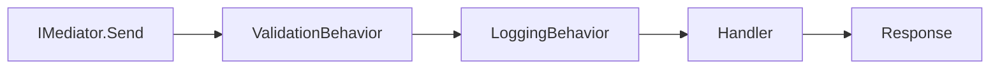

## Overview

FullStackHero implements **CQRS (Command Query Responsibility Segregation)** using the Mediator library. Commands represent write operations, while queries represent read operations.

<Note>
  This project uses the **Mediator** library (not MediatR). The interfaces and patterns are different.
</Note>

## Commands vs Queries

<CardGroup cols={2}>
  <Card title="Commands" icon="pen-to-square">
    **Write Operations**
    - Modify state
    - Create, Update, Delete
    - Return result or void
    - Use `ICommand<T>`
  </Card>
  <Card title="Queries" icon="magnifying-glass">
    **Read Operations**
    - Read-only
    - Fetch data
    - Always return data
    - Use `IQuery<T>`
  </Card>
</CardGroup>

## ICommand Interface

Commands represent operations that change system state.

### Command with Response

When your command needs to return data:

```csharp title="CreateGroupCommand.cs"
using FSH.Modules.Identity.Contracts.DTOs;
using Mediator;

namespace FSH.Modules.Identity.Contracts.v1.Groups.CreateGroup;

public sealed record CreateGroupCommand(
    string Name,
    string? Description,
    bool IsDefault,
    List<string>? RoleIds) : ICommand<GroupDto>;
```

### Command without Response

For commands that don't need to return data:

```csharp title="DeleteGroupCommand.cs"
using Mediator;

namespace FSH.Modules.Identity.Contracts.v1.Groups.DeleteGroup;

public sealed record DeleteGroupCommand(Guid Id) : ICommand;
```

<Note>
  Use `ICommand` (no generic parameter) when the command doesn't return data.
</Note>

## IQuery Interface

Queries represent read-only operations that fetch data.

### Simple Query

```csharp title="GetGroupByIdQuery.cs"
using FSH.Modules.Identity.Contracts.DTOs;
using Mediator;

namespace FSH.Modules.Identity.Contracts.v1.Groups.GetGroupById;

public sealed record GetGroupByIdQuery(Guid Id) : IQuery<GroupDto>;
```

### Paginated Query

```csharp title="GetGroupsQuery.cs"
using FSH.Modules.Identity.Contracts.DTOs;
using Mediator;

namespace FSH.Modules.Identity.Contracts.v1.Groups.GetGroups;

public sealed record GetGroupsQuery(
    string? Search,
    int PageNumber = 1,
    int PageSize = 10) : IQuery<PaginatedList<GroupDto>>;
```

## Command Handlers

Command handlers implement `ICommandHandler<TCommand, TResponse>` and contain the business logic.

### Handler with Response

```csharp title="CreateGroupCommandHandler.cs"
using FSH.Framework.Core.Context;
using FSH.Modules.Identity.Contracts.DTOs;
using FSH.Modules.Identity.Contracts.v1.Groups.CreateGroup;
using FSH.Modules.Identity.Data;
using FSH.Modules.Identity.Domain;
using Mediator;
using Microsoft.EntityFrameworkCore;

namespace FSH.Modules.Identity.Features.v1.Groups.CreateGroup;

public sealed class CreateGroupCommandHandler : ICommandHandler<CreateGroupCommand, GroupDto>
{
    private readonly IdentityDbContext _dbContext;
    private readonly ICurrentUser _currentUser;

    public CreateGroupCommandHandler(IdentityDbContext dbContext, ICurrentUser currentUser)
    {
        _dbContext = dbContext;
        _currentUser = currentUser;
    }

    public async ValueTask<GroupDto> Handle(CreateGroupCommand command, CancellationToken cancellationToken)
    {
        ArgumentNullException.ThrowIfNull(command);

        var group = Group.Create(
            name: command.Name,
            description: command.Description,
            isDefault: command.IsDefault,
            isSystemGroup: false,
            createdBy: _currentUser.GetUserId().ToString());

        _dbContext.Groups.Add(group);
        await _dbContext.SaveChangesAsync(cancellationToken);

        return new GroupDto
        {
            Id = group.Id,
            Name = group.Name,
            Description = group.Description,
            IsDefault = group.IsDefault,
            CreatedAt = group.CreatedAt
        };
    }
}
```

<Note>
  Handlers must return `ValueTask<TResponse>`, not `Task<TResponse>`. This is a Mediator library requirement.
</Note>

### Handler without Response

```csharp title="DeleteGroupCommandHandler.cs"
using FSH.Framework.Core.Exceptions;
using FSH.Modules.Identity.Contracts.v1.Groups.DeleteGroup;
using FSH.Modules.Identity.Data;
using Mediator;
using Microsoft.EntityFrameworkCore;

namespace FSH.Modules.Identity.Features.v1.Groups.DeleteGroup;

public sealed class DeleteGroupCommandHandler : ICommandHandler<DeleteGroupCommand>
{
    private readonly IdentityDbContext _dbContext;

    public DeleteGroupCommandHandler(IdentityDbContext dbContext)
    {
        _dbContext = dbContext;
    }

    public async ValueTask<Unit> Handle(DeleteGroupCommand command, CancellationToken cancellationToken)
    {
        ArgumentNullException.ThrowIfNull(command);

        var group = await _dbContext.Groups
            .FirstOrDefaultAsync(g => g.Id == command.Id, cancellationToken)
            ?? throw new NotFoundException($"Group with ID '{command.Id}' not found.");

        if (group.IsSystemGroup)
        {
            throw new InvalidOperationException("System groups cannot be deleted.");
        }

        _dbContext.Groups.Remove(group);
        await _dbContext.SaveChangesAsync(cancellationToken);

        return Unit.Value;
    }
}
```

## Query Handlers

Query handlers implement `IQueryHandler<TQuery, TResponse>` and handle read operations.

### Simple Query Handler

```csharp title="GetGroupByIdQueryHandler.cs"
using FSH.Framework.Core.Exceptions;
using FSH.Modules.Identity.Contracts.DTOs;
using FSH.Modules.Identity.Contracts.v1.Groups.GetGroupById;
using FSH.Modules.Identity.Data;
using Mediator;
using Microsoft.EntityFrameworkCore;

namespace FSH.Modules.Identity.Features.v1.Groups.GetGroupById;

public sealed class GetGroupByIdQueryHandler : IQueryHandler<GetGroupByIdQuery, GroupDto>
{
    private readonly IdentityDbContext _dbContext;

    public GetGroupByIdQueryHandler(IdentityDbContext dbContext)
    {
        _dbContext = dbContext;
    }

    public async ValueTask<GroupDto> Handle(GetGroupByIdQuery query, CancellationToken cancellationToken)
    {
        var group = await _dbContext.Groups
            .Include(g => g.GroupRoles)
            .FirstOrDefaultAsync(g => g.Id == query.Id, cancellationToken)
            ?? throw new NotFoundException($"Group with ID '{query.Id}' not found.");

        var memberCount = await _dbContext.UserGroups
            .CountAsync(ug => ug.GroupId == group.Id, cancellationToken);

        var roleIds = group.GroupRoles.Select(gr => gr.RoleId).ToList();
        var roleNames = roleIds.Count > 0
            ? await _dbContext.Roles
                .Where(r => roleIds.Contains(r.Id))
                .Select(r => r.Name!)
                .ToListAsync(cancellationToken)
            : [];

        return new GroupDto
        {
            Id = group.Id,
            Name = group.Name,
            Description = group.Description,
            IsDefault = group.IsDefault,
            IsSystemGroup = group.IsSystemGroup,
            MemberCount = memberCount,
            RoleIds = roleIds.AsReadOnly(),
            RoleNames = roleNames.AsReadOnly(),
            CreatedAt = group.CreatedAt
        };
    }
}
```

## Dispatching Commands and Queries

Use `IMediator` to dispatch commands and queries:

```csharp
// In your endpoint or controller
public static RouteHandlerBuilder MapCreateGroupEndpoint(this IEndpointRouteBuilder endpoints)
{
    return endpoints.MapPost("/groups", async (IMediator mediator, CreateGroupCommand request, CancellationToken ct) =>
    {
        var result = await mediator.Send(request, ct);
        return Results.Created($"/api/v1/groups/{result.Id}", result);
    });
}
```

## Key Differences from MediatR

<CardGroup cols={2}>
  <Card title="Interface Names" icon="signature">
    **Mediator Library**
    - `ICommand<T>`
    - `IQuery<T>`
    - `ICommandHandler<T,R>`
    - `IQueryHandler<T,R>`
    
    **MediatR**
    - `IRequest<T>`
    - `IRequestHandler<T,R>`
  </Card>
  <Card title="Return Types" icon="arrow-turn-down-left">
    **Mediator Library**
    - `ValueTask<T>`
    
    **MediatR**
    - `Task<T>`
  </Card>
</CardGroup>

## Best Practices

<Steps>

### Use Records for Immutability

Define commands and queries as `record` types for immutability:

```csharp
public sealed record CreateGroupCommand(...) : ICommand<GroupDto>;
```

### Null Checking

Always validate command parameters:

```csharp
public async ValueTask<GroupDto> Handle(CreateGroupCommand command, CancellationToken cancellationToken)
{
    ArgumentNullException.ThrowIfNull(command);
    // ... handler logic
}
```

### Use Descriptive Names

Follow naming conventions:
- Commands: `{Verb}{Entity}Command` (CreateGroupCommand, UpdateGroupCommand)
- Queries: `Get{Entity(s)}Query` (GetGroupByIdQuery, GetGroupsQuery)
- Handlers: `{CommandOrQuery}Handler` (CreateGroupCommandHandler)

### Return Appropriate Types

- Commands that create: Return the created entity or its ID
- Commands that update: Return the updated entity
- Commands that delete: Return `Unit` (void)
- Queries: Always return data

</Steps>

## Pipeline Behaviors

The Mediator pipeline automatically processes commands/queries through behaviors:



These behaviors are configured in `src/BuildingBlocks/Web/Extensions.cs`:

```csharp title="Extensions.cs"
builder.Services.AddTransient(typeof(IPipelineBehavior<,>), typeof(ValidationBehavior<,>));
```

## Next Steps

<CardGroup cols={3}>
  <Card title="Validation" href="/development/validation" icon="shield-check">
    Add FluentValidation to commands
  </Card>
  <Card title="Endpoints" href="/development/endpoints" icon="route">
    Map commands to HTTP endpoints
  </Card>
  <Card title="Testing" href="/development/testing" icon="flask">
    Unit test your handlers
  </Card>
</CardGroup>
