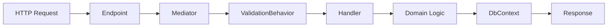

## Overview

Every feature in FullStackHero follows the **vertical slice architecture** pattern. Each feature is self-contained with its own command/query, handler, validator, and endpoint.

## Feature Structure

Features are organized in a consistent folder structure:

```
Modules/{Module}/Features/v1/{Feature}/
├── {Action}{Entity}Command.cs      # ICommand<T> or IQuery<T>
├── {Action}{Entity}Handler.cs      # ICommandHandler<T,R> or IQueryHandler<T,R>
├── {Action}{Entity}Validator.cs    # AbstractValidator<T>
└── {Action}{Entity}Endpoint.cs     # MapPost/Get/Put/Delete
```

## Complete Example: Create Group Feature

Let's walk through a real feature from the Identity module that creates a new group.

<Steps>

### Step 1: Define the Command

Create the command in the Contracts project. Commands represent write operations and implement `ICommand<T>`.

```csharp title="Modules.Identity.Contracts/v1/Groups/CreateGroup/CreateGroupCommand.cs"
using FSH.Modules.Identity.Contracts.DTOs;
using Mediator;

namespace FSH.Modules.Identity.Contracts.v1.Groups.CreateGroup;

public sealed record CreateGroupCommand(
    string Name,
    string? Description,
    bool IsDefault,
    List<string>? RoleIds) : ICommand<GroupDto>;
```

<Note>
  Use `ICommand<TResponse>` for commands that return data. For commands with no response, use `ICommand`.
</Note>

### Step 2: Create the Validator

Every command must have a corresponding validator using FluentValidation.

```csharp title="Modules.Identity/Features/v1/Groups/CreateGroup/CreateGroupCommandValidator.cs"
using FluentValidation;
using FSH.Modules.Identity.Contracts.v1.Groups.CreateGroup;

namespace FSH.Modules.Identity.Features.v1.Groups.CreateGroup;

public sealed class CreateGroupCommandValidator : AbstractValidator<CreateGroupCommand>
{
    public CreateGroupCommandValidator()
    {
        RuleFor(x => x.Name)
            .NotEmpty().WithMessage("Group name is required.")
            .MaximumLength(256).WithMessage("Group name must not exceed 256 characters.");

        RuleFor(x => x.Description)
            .MaximumLength(1024).WithMessage("Description must not exceed 1024 characters.");
    }
}
```

<Note>
  Validators are automatically discovered and executed by the ValidationBehavior pipeline.
</Note>

### Step 3: Implement the Handler

Handlers contain the business logic. They implement `ICommandHandler<TCommand, TResponse>`.

```csharp title="Modules.Identity/Features/v1/Groups/CreateGroup/CreateGroupCommandHandler.cs"
using FSH.Framework.Core.Context;
using FSH.Framework.Core.Exceptions;
using FSH.Modules.Identity.Contracts.DTOs;
using FSH.Modules.Identity.Contracts.v1.Groups.CreateGroup;
using FSH.Modules.Identity.Data;
using FSH.Modules.Identity.Domain;
using Mediator;
using Microsoft.EntityFrameworkCore;

namespace FSH.Modules.Identity.Features.v1.Groups.CreateGroup;

public sealed class CreateGroupCommandHandler : ICommandHandler<CreateGroupCommand, GroupDto>
{
    private readonly IdentityDbContext _dbContext;
    private readonly ICurrentUser _currentUser;

    public CreateGroupCommandHandler(IdentityDbContext dbContext, ICurrentUser currentUser)
    {
        _dbContext = dbContext;
        _currentUser = currentUser;
    }

    public async ValueTask<GroupDto> Handle(CreateGroupCommand command, CancellationToken cancellationToken)
    {
        ArgumentNullException.ThrowIfNull(command);

        // Validate name is unique within tenant
        var nameExists = await _dbContext.Groups
            .AnyAsync(g => g.Name == command.Name, cancellationToken);

        if (nameExists)
        {
            throw new CustomException($"Group with name '{command.Name}' already exists.", 
                (IEnumerable<string>?)null, System.Net.HttpStatusCode.Conflict);
        }

        // Validate role IDs exist
        if (command.RoleIds is { Count: > 0 })
        {
            var existingRoleIds = await _dbContext.Roles
                .Where(r => command.RoleIds.Contains(r.Id))
                .Select(r => r.Id)
                .ToListAsync(cancellationToken);

            var invalidRoleIds = command.RoleIds.Except(existingRoleIds).ToList();
            if (invalidRoleIds.Count > 0)
            {
                throw new NotFoundException($"Roles not found: {string.Join(", ", invalidRoleIds)}");
            }
        }

        var group = Group.Create(
            name: command.Name,
            description: command.Description,
            isDefault: command.IsDefault,
            isSystemGroup: false,
            createdBy: _currentUser.GetUserId().ToString());

        // Add role assignments
        if (command.RoleIds is { Count: > 0 })
        {
            foreach (var roleId in command.RoleIds)
            {
                _dbContext.GroupRoles.Add(GroupRole.Create(group.Id, roleId));
            }
        }

        _dbContext.Groups.Add(group);
        await _dbContext.SaveChangesAsync(cancellationToken);

        // Get role names for response
        var roleNames = command.RoleIds is { Count: > 0 }
            ? await _dbContext.Roles
                .Where(r => command.RoleIds.Contains(r.Id))
                .Select(r => r.Name!)
                .ToListAsync(cancellationToken)
            : [];

        return new GroupDto
        {
            Id = group.Id,
            Name = group.Name,
            Description = group.Description,
            IsDefault = group.IsDefault,
            IsSystemGroup = group.IsSystemGroup,
            MemberCount = 0,
            RoleIds = command.RoleIds?.AsReadOnly(),
            RoleNames = roleNames.AsReadOnly(),
            CreatedAt = group.CreatedAt
        };
    }
}
```

<Note>
  Handlers must return `ValueTask<TResponse>` not `Task<TResponse>`. This is a requirement of the Mediator library.
</Note>

### Step 4: Define the Endpoint

Endpoints map HTTP routes to commands/queries using minimal APIs.

```csharp title="Modules.Identity/Features/v1/Groups/CreateGroup/CreateGroupEndpoint.cs"
using FSH.Framework.Shared.Identity;
using FSH.Framework.Shared.Identity.Authorization;
using FSH.Modules.Identity.Contracts.v1.Groups.CreateGroup;
using Mediator;
using Microsoft.AspNetCore.Builder;
using Microsoft.AspNetCore.Http;
using Microsoft.AspNetCore.Mvc;
using Microsoft.AspNetCore.Routing;

namespace FSH.Modules.Identity.Features.v1.Groups.CreateGroup;

public static class CreateGroupEndpoint
{
    public static RouteHandlerBuilder MapCreateGroupEndpoint(this IEndpointRouteBuilder endpoints)
    {
        return endpoints.MapPost("/groups", (IMediator mediator, [FromBody] CreateGroupCommand request, CancellationToken cancellationToken) =>
            mediator.Send(request, cancellationToken))
        .WithName("CreateGroup")
        .WithSummary("Create a new group")
        .RequirePermission(IdentityPermissionConstants.Groups.Create)
        .WithDescription("Create a new group with optional role assignments.");
    }
}
```

</Steps>

## Domain Entity Pattern

Domain entities use rich domain models with factory methods and private setters:

```csharp title="Modules.Identity/Domain/Group.cs"
using FSH.Framework.Core.Domain;

namespace FSH.Modules.Identity.Domain;

public class Group : ISoftDeletable
{
    public Guid Id { get; private set; }
    public string Name { get; private set; } = default!;
    public string? Description { get; private set; }
    public bool IsDefault { get; private set; }
    public bool IsSystemGroup { get; private set; }
    public DateTime CreatedAt { get; private set; }
    public string? CreatedBy { get; private set; }

    // Navigation properties
    public virtual ICollection<GroupRole> GroupRoles { get; private set; } = [];
    public virtual ICollection<UserGroup> UserGroups { get; private set; } = [];

    private Group() { } // EF Core constructor

    public static Group Create(string name, string? description = null, 
        bool isDefault = false, bool isSystemGroup = false, string? createdBy = null)
    {
        return new Group
        {
            Id = Guid.NewGuid(),
            Name = name,
            Description = description,
            IsDefault = isDefault,
            IsSystemGroup = isSystemGroup,
            CreatedAt = DateTime.UtcNow,
            CreatedBy = createdBy
        };
    }

    public void Update(string name, string? description, string? modifiedBy = null)
    {
        Name = name;
        Description = description;
        ModifiedAt = DateTime.UtcNow;
        ModifiedBy = modifiedBy;
    }
}
```

## Key Principles

<CardGroup cols={2}>
  <Card title="Single Responsibility" icon="layer-group">
    Each feature handles one specific use case with all its components in one folder
  </Card>
  <Card title="Mediator Pattern" icon="arrows-split-up-and-left">
    Use `IMediator.Send()` to dispatch commands and queries through the pipeline
  </Card>
  <Card title="Always Validate" icon="shield-check">
    Every command/query must have a validator - no exceptions
  </Card>
  <Card title="Rich Domain Models" icon="cube">
    Use factory methods and encapsulation to protect domain invariants
  </Card>
</CardGroup>

## Feature Flow



## Next Steps

<CardGroup cols={2}>
  <Card title="Commands & Queries" href="/development/commands-queries" icon="code">
    Learn the difference between ICommand and IQuery
  </Card>
  <Card title="Endpoints" href="/development/endpoints" icon="route">
    Master minimal API endpoint mapping
  </Card>
  <Card title="Validation" href="/development/validation" icon="shield-check">
    Deep dive into FluentValidation patterns
  </Card>
  <Card title="Testing" href="/development/testing" icon="flask">
    Write tests for your features
  </Card>
</CardGroup>
