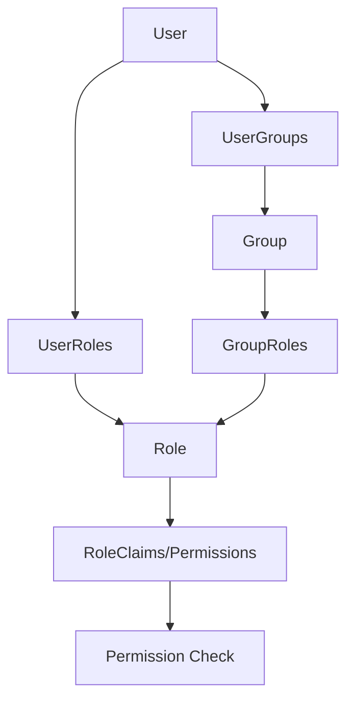

## Overview

FullStackHero implements **permission-based authorization** where access control is determined by specific permissions rather than roles. Roles and groups are containers for permissions.

## Permission System Architecture



- **Users** can have direct **Roles** or be members of **Groups**
- **Groups** contain **Roles**
- **Roles** contain **Permissions** (stored as claims)
- Authorization checks **Permissions**, not roles

## Permission Constants

Permissions are defined as constants in the Shared project:

```csharp title="IdentityPermissionConstants.cs"
namespace FSH.Framework.Shared.Identity;

public static class IdentityPermissionConstants
{
    public static class Users
    {
        public const string View = "Permissions.Users.View";
        public const string Create = "Permissions.Users.Create";
        public const string Update = "Permissions.Users.Update";
        public const string Delete = "Permissions.Users.Delete";
        public const string ManageRoles = "Permissions.Users.ManageRoles";
    }

    public static class Roles
    {
        public const string View = "Permissions.Roles.View";
        public const string Create = "Permissions.Roles.Create";
        public const string Update = "Permissions.Roles.Update";
        public const string Delete = "Permissions.Roles.Delete";
    }

    public static class Groups
    {
        public const string View = "Permissions.Groups.View";
        public const string Create = "Permissions.Groups.Create";
        public const string Update = "Permissions.Groups.Update";
        public const string Delete = "Permissions.Groups.Delete";
        public const string ManageMembers = "Permissions.Groups.ManageMembers";
    }
}
```

<Note>
  Permission constants follow the pattern: `Permissions.{Resource}.{Action}`
</Note>

## Protecting Endpoints

Use `.RequirePermission()` to protect endpoints:

```csharp title="CreateGroupEndpoint.cs"
using FSH.Framework.Shared.Identity;
using FSH.Framework.Shared.Identity.Authorization;
using Mediator;
using Microsoft.AspNetCore.Builder;
using Microsoft.AspNetCore.Routing;

public static class CreateGroupEndpoint
{
    public static RouteHandlerBuilder MapCreateGroupEndpoint(this IEndpointRouteBuilder endpoints)
    {
        return endpoints.MapPost("/groups", (IMediator mediator, CreateGroupCommand request, CancellationToken ct) =>
            mediator.Send(request, ct))
        .WithName("CreateGroup")
        .WithSummary("Create a new group")
        .RequirePermission(IdentityPermissionConstants.Groups.Create);  // ✅ Permission check
    }
}
```

### Multiple Permissions

Require multiple permissions for an endpoint:

```csharp
.RequirePermission(
    IdentityPermissionConstants.Groups.View,
    IdentityPermissionConstants.Groups.ManageMembers)
```

## RequirePermission Extension

The `.RequirePermission()` extension method adds metadata to endpoints:

```csharp title="EndpointExtensions.cs"
using Microsoft.AspNetCore.Builder;

namespace FSH.Framework.Shared.Identity.Authorization;

public static class EndpointExtensions
{
    public static TBuilder RequirePermission<TBuilder>(
        this TBuilder endpointConventionBuilder, 
        string requiredPermission, 
        params string[] additionalRequiredPermissions)
        where TBuilder : IEndpointConventionBuilder
    {
        return endpointConventionBuilder.WithMetadata(
            new RequiredPermissionAttribute(requiredPermission, additionalRequiredPermissions));
    }
}
```

## RequiredPermissionAttribute

The attribute stores permission metadata:

```csharp title="RequiredPermissionAttribute.cs"
namespace FSH.Framework.Shared.Identity.Authorization;

public interface IRequiredPermissionMetadata
{
    HashSet<string> RequiredPermissions { get; }
}

[AttributeUsage(AttributeTargets.Class | AttributeTargets.Method)]
public sealed class RequiredPermissionAttribute : Attribute, IRequiredPermissionMetadata
{
    public HashSet<string> RequiredPermissions { get; }
    public string? RequiredPermission { get; }
    public string[]? AdditionalRequiredPermissions { get; }

    public RequiredPermissionAttribute(string? requiredPermission, params string[]? additionalRequiredPermissions)
    {
        RequiredPermission = requiredPermission;
        AdditionalRequiredPermissions = additionalRequiredPermissions;

        var permissions = new HashSet<string>(StringComparer.OrdinalIgnoreCase);
        if (!string.IsNullOrWhiteSpace(requiredPermission))
        {
            permissions.Add(requiredPermission);
        }

        if (additionalRequiredPermissions is { Length: > 0 })
        {
            foreach (var p in additionalRequiredPermissions.Where(p => !string.IsNullOrWhiteSpace(p)))
            {
                permissions.Add(p);
            }
        }

        RequiredPermissions = permissions;
    }
}
```

## Authorization Handler

The `RequiredPermissionAuthorizationHandler` checks if the user has the required permissions:

```csharp title="RequiredPermissionAuthorizationHandler.cs"
using FSH.Framework.Shared.Identity.Claims;
using FSH.Modules.Identity.Contracts.Services;
using Microsoft.AspNetCore.Authorization;
using Microsoft.AspNetCore.Http;

namespace FSH.Modules.Identity.Authorization;

public sealed class RequiredPermissionAuthorizationHandler(IUserService userService) 
    : AuthorizationHandler<PermissionAuthorizationRequirement>
{
    protected override async Task HandleRequirementAsync(
        AuthorizationHandlerContext context, 
        PermissionAuthorizationRequirement requirement)
    {
        ArgumentNullException.ThrowIfNull(context);
        ArgumentNullException.ThrowIfNull(requirement);

        var httpContext = context.Resource as HttpContext;
        var endpoint = context.Resource switch
        {
            HttpContext ctx => ctx.GetEndpoint(),
            Endpoint ep => ep,
            _ => null,
        };

        // Get required permissions from endpoint metadata
        var requiredPermissions = endpoint?.Metadata
            .GetMetadata<IRequiredPermissionMetadata>()?.
            RequiredPermissions;

        if (requiredPermissions == null)
        {
            // No permission requirements - authorize request
            context.Succeed(requirement);
            return;
        }

        // Check if user has the required permission
        var cancellationToken = httpContext?.RequestAborted ?? CancellationToken.None;
        if (context.User?.GetUserId() is { } userId && 
            await userService.HasPermissionAsync(userId, requiredPermissions.First(), cancellationToken))
        {
            context.Succeed(requirement);
        }
    }
}
```

## Roles and Permissions

### Assigning Permissions to Roles

Roles contain permissions stored as claims:

```csharp
// In your seed data or admin UI
var adminRole = new FshRole
{
    Name = "Admin",
    Description = "Administrator role"
};

var permissions = new[]
{
    IdentityPermissionConstants.Users.View,
    IdentityPermissionConstants.Users.Create,
    IdentityPermissionConstants.Users.Update,
    IdentityPermissionConstants.Users.Delete,
    IdentityPermissionConstants.Groups.View,
    IdentityPermissionConstants.Groups.Create
};

foreach (var permission in permissions)
{
    await roleManager.AddClaimAsync(adminRole, new Claim(ClaimTypes.Permission, permission));
}
```

### Updating Role Permissions

The `UpdatePermissionsCommand` updates role permissions:

```csharp title="UpdatePermissionsCommand.cs"
using Mediator;

namespace FSH.Modules.Identity.Contracts.v1.Roles.UpdatePermissions;

public class UpdatePermissionsCommand : ICommand<string>
{
    public string RoleId { get; set; } = default!;
    public List<string> Permissions { get; set; } = [];
}
```

## Groups and Permissions

### Group-Based Authorization

Groups are collections of roles, providing an additional layer of permission organization:

```csharp title="Group.cs"
public class Group : ISoftDeletable
{
    public Guid Id { get; private set; }
    public string Name { get; private set; } = default!;
    public string? Description { get; private set; }
    public bool IsDefault { get; private set; }
    
    // Navigation properties
    public virtual ICollection<GroupRole> GroupRoles { get; private set; } = [];
    public virtual ICollection<UserGroup> UserGroups { get; private set; } = [];

    public static Group Create(string name, string? description = null, 
        bool isDefault = false, bool isSystemGroup = false, string? createdBy = null)
    {
        return new Group
        {
            Id = Guid.NewGuid(),
            Name = name,
            Description = description,
            IsDefault = isDefault,
            IsSystemGroup = isSystemGroup,
            CreatedAt = DateTime.UtcNow,
            CreatedBy = createdBy
        };
    }
}
```

### Assigning Roles to Groups

```csharp title="CreateGroupCommandHandler.cs (excerpt)"
// Add role assignments to group
if (command.RoleIds is { Count: > 0 })
{
    foreach (var roleId in command.RoleIds)
    {
        _dbContext.GroupRoles.Add(GroupRole.Create(group.Id, roleId));
    }
}
```

### User Permission Resolution

When checking permissions, the system resolves permissions from:

1. **Direct user roles** → Permissions
2. **User groups** → Group roles → Permissions

```csharp
// Pseudo-code for permission resolution
var userPermissions = new HashSet<string>();

// Get permissions from user's direct roles
foreach (var role in user.Roles)
{
    userPermissions.UnionWith(role.Claims.Where(c => c.Type == "Permission").Select(c => c.Value));
}

// Get permissions from user's groups
foreach (var group in user.Groups)
{
    foreach (var role in group.Roles)
    {
        userPermissions.UnionWith(role.Claims.Where(c => c.Type == "Permission").Select(c => c.Value));
    }
}
```

## Checking Permissions in Code

### In Handlers

Check permissions manually in handlers if needed:

```csharp
public async ValueTask<GroupDto> Handle(DeleteGroupCommand command, CancellationToken cancellationToken)
{
    var userId = _currentUser.GetUserId().ToString();
    
    // Manual permission check
    if (!await _userService.HasPermissionAsync(userId, IdentityPermissionConstants.Groups.Delete, cancellationToken))
    {
        throw new UnauthorizedAccessException("You do not have permission to delete groups.");
    }
    
    // ... rest of handler logic
}
```

### In Services

```csharp
public interface IUserService
{
    Task<bool> HasPermissionAsync(string userId, string permission, CancellationToken cancellationToken);
}
```

## Permission Naming Conventions

<Steps>

### Use Hierarchical Structure

```
Permissions.{Module}.{Resource}.{Action}
```

Examples:
- `Permissions.Identity.Users.View`
- `Permissions.Catalog.Products.Create`
- `Permissions.Orders.Invoices.Delete`

### Action Naming

Common actions:
- `View` - Read access
- `Create` - Create new entities
- `Update` - Modify existing entities
- `Delete` - Remove entities
- `Manage` - Full control (CRUD)

### Special Permissions

- `ManageRoles` - Assign/remove roles
- `ManageMembers` - Add/remove group members
- `ViewAll` - See all records (not just owned)
- `Export` - Export data

</Steps>

## Best Practices

<CardGroup cols={2}>
  <Card title="Fine-Grained Permissions" icon="list-check">
    Create specific permissions for each action rather than broad permissions
  </Card>
  <Card title="Always Check at Endpoint" icon="shield-check">
    Every endpoint must have `.RequirePermission()` - no exceptions
  </Card>
  <Card title="Avoid Role Checks" icon="ban">
    Check permissions, not roles. Roles are just containers for permissions
  </Card>
  <Card title="Document Permissions" icon="book">
    Maintain a list of all permissions in documentation
  </Card>
</CardGroup>

## Testing Authorization

### Integration Tests

```csharp
[Fact]
public async Task CreateGroup_Without_Permission_Should_Return403()
{
    // Arrange
    var command = new CreateGroupCommand("Admins", "Admin group", false, null);
    var client = _factory.CreateClientWithoutPermissions();
    
    // Act
    var response = await client.PostAsJsonAsync("/api/v1/identity/groups", command);
    
    // Assert
    response.StatusCode.ShouldBe(HttpStatusCode.Forbidden);
}

[Fact]
public async Task CreateGroup_With_Permission_Should_Return201()
{
    // Arrange
    var command = new CreateGroupCommand("Admins", "Admin group", false, null);
    var client = _factory.CreateClientWithPermission(IdentityPermissionConstants.Groups.Create);
    
    // Act
    var response = await client.PostAsJsonAsync("/api/v1/identity/groups", command);
    
    // Assert
    response.StatusCode.ShouldBe(HttpStatusCode.Created);
}
```

## Next Steps

<CardGroup cols={3}>
  <Card title="Endpoints" href="/development/endpoints" icon="route">
    Apply permissions to endpoints
  </Card>
  <Card title="Testing" href="/development/testing" icon="flask">
    Test authorization logic
  </Card>
  <Card title="Creating Features" href="/development/creating-features" icon="code">
    Build complete features with auth
  </Card>
</CardGroup>
