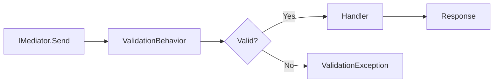

## Overview

FullStackHero uses **FluentValidation** to validate commands and queries. Validation happens automatically in the mediator pipeline before the handler executes.

<Note>
  Every command must have a corresponding validator. This is enforced by architecture tests.
</Note>

## Validation Pipeline

Validation is automatically executed through the `ValidationBehavior` pipeline:



The pipeline is configured in `src/BuildingBlocks/Web/Extensions.cs`:

```csharp title="Extensions.cs"
builder.Services.AddTransient(typeof(IPipelineBehavior<,>), typeof(ValidationBehavior<,>));
```

## ValidationBehavior Implementation

The validation behavior executes all validators for a command/query:

```csharp title="ValidationBehavior.cs"
using FluentValidation;
using Mediator;

namespace FSH.Framework.Web.Mediator.Behaviors;

public sealed class ValidationBehavior<TMessage, TResponse>(IEnumerable<IValidator<TMessage>> validators) 
    : IPipelineBehavior<TMessage, TResponse>
    where TMessage : IMessage
{
    private readonly IEnumerable<IValidator<TMessage>> _validators = validators;

    public async ValueTask<TResponse> Handle(
        TMessage message,
        MessageHandlerDelegate<TMessage, TResponse> next,
        CancellationToken cancellationToken)
    {
        ArgumentNullException.ThrowIfNull(next);

        if (_validators.Any())
        {
            var context = new ValidationContext<TMessage>(message);
            var validationResults = await Task.WhenAll(
                _validators.Select(v => v.ValidateAsync(context, cancellationToken)));
            
            var failures = validationResults
                .SelectMany(r => r.Errors)
                .Where(f => f != null)
                .ToList();

            if (failures.Count > 0)
                throw new ValidationException(failures);
        }
        
        return await next(message, cancellationToken);
    }
}
```

## Creating Validators

Validators inherit from `AbstractValidator<T>` and use FluentValidation's fluent API.

### Basic Validator

```csharp title="CreateGroupCommandValidator.cs"
using FluentValidation;
using FSH.Modules.Identity.Contracts.v1.Groups.CreateGroup;

namespace FSH.Modules.Identity.Features.v1.Groups.CreateGroup;

public sealed class CreateGroupCommandValidator : AbstractValidator<CreateGroupCommand>
{
    public CreateGroupCommandValidator()
    {
        RuleFor(x => x.Name)
            .NotEmpty().WithMessage("Group name is required.")
            .MaximumLength(256).WithMessage("Group name must not exceed 256 characters.");

        RuleFor(x => x.Description)
            .MaximumLength(1024).WithMessage("Description must not exceed 1024 characters.");
    }
}
```

### Complex Validator with Multiple Rules

```csharp title="UpdateGroupCommandValidator.cs"
using FluentValidation;
using FSH.Modules.Identity.Contracts.v1.Groups.UpdateGroup;

namespace FSH.Modules.Identity.Features.v1.Groups.UpdateGroup;

public sealed class UpdateGroupCommandValidator : AbstractValidator<UpdateGroupCommand>
{
    public UpdateGroupCommandValidator()
    {
        RuleFor(x => x.Id)
            .NotEmpty().WithMessage("Group ID is required.");

        RuleFor(x => x.Name)
            .NotEmpty().WithMessage("Group name is required.")
            .MaximumLength(256).WithMessage("Group name must not exceed 256 characters.");

        RuleFor(x => x.Description)
            .MaximumLength(1024).WithMessage("Description must not exceed 1024 characters.");
    }
}
```

## Common Validation Rules

<CodeGroup>

```csharp Not Empty
RuleFor(x => x.Name)
    .NotEmpty()
    .WithMessage("Name is required.");
```

```csharp String Length
RuleFor(x => x.Name)
    .MaximumLength(256)
    .WithMessage("Name must not exceed 256 characters.");

RuleFor(x => x.Password)
    .MinimumLength(8)
    .WithMessage("Password must be at least 8 characters.");
```

```csharp Email
RuleFor(x => x.Email)
    .NotEmpty()
    .EmailAddress()
    .WithMessage("A valid email address is required.");
```

```csharp Regex Pattern
RuleFor(x => x.PhoneNumber)
    .Matches(@"^\+?[1-9]\d{1,14}$")
    .WithMessage("Invalid phone number format.");
```

```csharp Must Condition
RuleFor(x => x.StartDate)
    .Must(date => date > DateTime.UtcNow)
    .WithMessage("Start date must be in the future.");
```

```csharp Custom Validator
RuleFor(x => x.Age)
    .Must(BeValidAge)
    .WithMessage("Age must be between 18 and 120.");

private bool BeValidAge(int age)
{
    return age >= 18 && age <= 120;
}
```

</CodeGroup>

## Nested Object Validation

Validate complex nested objects:

```csharp title="CreateUserCommandValidator.cs"
public sealed class CreateUserCommandValidator : AbstractValidator<CreateUserCommand>
{
    public CreateUserCommandValidator()
    {
        RuleFor(x => x.Email)
            .NotEmpty()
            .EmailAddress();

        RuleFor(x => x.Profile)
            .NotNull()
            .SetValidator(new UserProfileValidator());
    }
}

public sealed class UserProfileValidator : AbstractValidator<UserProfile>
{
    public UserProfileValidator()
    {
        RuleFor(x => x.FirstName)
            .NotEmpty()
            .MaximumLength(100);

        RuleFor(x => x.LastName)
            .NotEmpty()
            .MaximumLength(100);

        RuleFor(x => x.PhoneNumber)
            .Matches(@"^\+?[1-9]\d{1,14}$")
            .When(x => !string.IsNullOrEmpty(x.PhoneNumber));
    }
}
```

## Collection Validation

Validate collections and their items:

```csharp title="AddUsersToGroupCommandValidator.cs"
public sealed class AddUsersToGroupCommandValidator : AbstractValidator<AddUsersToGroupCommand>
{
    public AddUsersToGroupCommandValidator()
    {
        RuleFor(x => x.GroupId)
            .NotEmpty()
            .WithMessage("Group ID is required.");

        RuleFor(x => x.UserIds)
            .NotNull()
            .NotEmpty()
            .WithMessage("At least one user ID is required.");

        RuleForEach(x => x.UserIds)
            .NotEmpty()
            .WithMessage("User ID cannot be empty.");
    }
}
```

## Conditional Validation

Apply rules conditionally:

```csharp title="UpdateUserCommandValidator.cs"
public sealed class UpdateUserCommandValidator : AbstractValidator<UpdateUserCommand>
{
    public UpdateUserCommandValidator()
    {
        RuleFor(x => x.Email)
            .NotEmpty()
            .EmailAddress();

        // Only validate password if it's being changed
        RuleFor(x => x.NewPassword)
            .MinimumLength(8)
            .When(x => !string.IsNullOrEmpty(x.NewPassword))
            .WithMessage("Password must be at least 8 characters.");

        // Require confirmation when password is provided
        RuleFor(x => x.ConfirmPassword)
            .Equal(x => x.NewPassword)
            .When(x => !string.IsNullOrEmpty(x.NewPassword))
            .WithMessage("Passwords must match.");
    }
}
```

## Async Validation

Perform async validation (e.g., database checks):

```csharp title="CreateUserCommandValidator.cs"
public sealed class CreateUserCommandValidator : AbstractValidator<CreateUserCommand>
{
    private readonly IUserService _userService;

    public CreateUserCommandValidator(IUserService userService)
    {
        _userService = userService;

        RuleFor(x => x.Email)
            .NotEmpty()
            .EmailAddress()
            .MustAsync(BeUniqueEmail)
            .WithMessage("Email address is already in use.");
    }

    private async Task<bool> BeUniqueEmail(string email, CancellationToken cancellationToken)
    {
        return !await _userService.EmailExistsAsync(email, cancellationToken);
    }
}
```

<Note>
  Use async validation sparingly. It adds latency and database load. Prefer handling uniqueness in the handler.
</Note>

## Custom Error Messages

### Static Messages

```csharp
RuleFor(x => x.Name)
    .NotEmpty()
    .WithMessage("Group name is required.");
```

### Dynamic Messages with Placeholders

```csharp
RuleFor(x => x.Name)
    .MaximumLength(256)
    .WithMessage("Name must not exceed {MaxLength} characters. You entered {TotalLength} characters.");
```

### Custom Messages with Lambda

```csharp
RuleFor(x => x.StartDate)
    .GreaterThan(DateTime.UtcNow)
    .WithMessage(x => $"Start date {x.StartDate:yyyy-MM-dd} must be in the future.");
```

## Validation Error Response

When validation fails, the API returns a `400 Bad Request` with error details:

```json
{
  "type": "https://tools.ietf.org/html/rfc7231#section-6.5.1",
  "title": "One or more validation errors occurred.",
  "status": 400,
  "errors": {
    "Name": [
      "Group name is required."
    ],
    "Description": [
      "Description must not exceed 1024 characters."
    ]
  }
}
```

## Testing Validators

Test validators using FluentValidation's `TestValidate()` method:

```csharp title="CreateGroupCommandValidatorTests.cs"
using FluentValidation.TestHelper;
using FSH.Modules.Identity.Contracts.v1.Groups.CreateGroup;
using FSH.Modules.Identity.Features.v1.Groups.CreateGroup;
using Xunit;

namespace Identity.Tests.Validators;

public sealed class CreateGroupCommandValidatorTests
{
    private readonly CreateGroupCommandValidator _validator;

    public CreateGroupCommandValidatorTests()
    {
        _validator = new CreateGroupCommandValidator();
    }

    [Fact]
    public void Should_Have_Error_When_Name_Is_Empty()
    {
        // Arrange
        var command = new CreateGroupCommand("", "Description", false, null);

        // Act
        var result = _validator.TestValidate(command);

        // Assert
        result.ShouldHaveValidationErrorFor(x => x.Name)
            .WithErrorMessage("Group name is required.");
    }

    [Fact]
    public void Should_Have_Error_When_Name_Exceeds_MaxLength()
    {
        // Arrange
        var longName = new string('A', 257);
        var command = new CreateGroupCommand(longName, null, false, null);

        // Act
        var result = _validator.TestValidate(command);

        // Assert
        result.ShouldHaveValidationErrorFor(x => x.Name)
            .WithErrorMessage("Group name must not exceed 256 characters.");
    }

    [Fact]
    public void Should_Not_Have_Error_When_Command_Is_Valid()
    {
        // Arrange
        var command = new CreateGroupCommand("Admins", "Admin group", false, null);

        // Act
        var result = _validator.TestValidate(command);

        // Assert
        result.ShouldNotHaveAnyValidationErrors();
    }
}
```

## Architecture Tests

The project includes architecture tests to ensure all commands have validators:

```csharp title="HandlerValidatorPairingTests.cs"
[Fact]
public void CommandHandlers_Should_Have_Corresponding_Validators()
{
    var missingValidators = new List<string>();

    foreach (var module in ModuleAssemblies)
    {
        var commandHandlerTypes = module.GetTypes()
            .Where(t => t.IsClass && !t.IsAbstract)
            .Where(t => t.GetInterfaces().Any(i =>
                i.IsGenericType &&
                (i.GetGenericTypeDefinition() == typeof(ICommandHandler<>) ||
                 i.GetGenericTypeDefinition() == typeof(ICommandHandler<,>))));

        foreach (var handlerType in commandHandlerTypes)
        {
            var commandType = handlerType.GetInterfaces()
                .First(i => i.IsGenericType)
                .GetGenericArguments()[0];

            var expectedValidatorName = commandType.Name + "Validator";

            var validatorExists = module.GetTypes()
                .Any(t => t.Name == expectedValidatorName);

            if (!validatorExists)
            {
                missingValidators.Add($"{handlerType.FullName} -> missing {expectedValidatorName}");
            }
        }
    }

    missingValidators.ShouldBeEmpty();
}
```

This test runs in CI and blocks merges if validators are missing.

## Best Practices

<Steps>

### One Validator Per Command/Query

Every command and query must have exactly one validator.

### Use Descriptive Error Messages

```csharp
// Good
.WithMessage("Group name is required and must not exceed 256 characters.")

// Bad
.WithMessage("Invalid input.")
```

### Validate at the Edge

Validate as early as possible (in validators) rather than in handlers.

### Keep Validators Simple

Avoid complex business logic in validators. Use them for input validation only.

### Use Built-in Validators

Prefer FluentValidation's built-in validators over custom implementations:
- `NotEmpty()`, `NotNull()`
- `EmailAddress()`, `CreditCard()`
- `GreaterThan()`, `LessThan()`, `InclusiveBetween()`

</Steps>

## Next Steps

<CardGroup cols={3}>
  <Card title="Commands & Queries" href="/development/commands-queries" icon="code">
    Learn about CQRS pattern
  </Card>
  <Card title="Endpoints" href="/development/endpoints" icon="route">
    Map validated commands to endpoints
  </Card>
  <Card title="Testing" href="/development/testing" icon="flask">
    Test your validators
  </Card>
</CardGroup>
