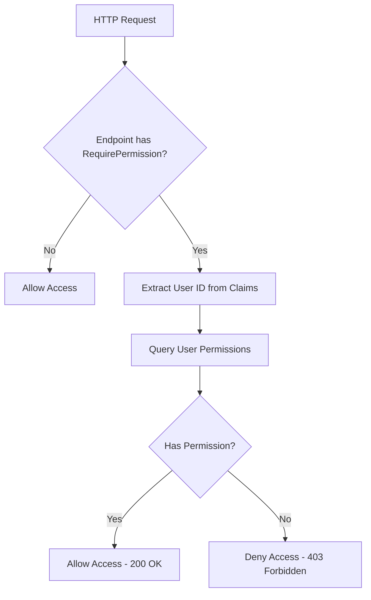

FullStackHero implements a flexible authorization system that supports both role-based access control (RBAC) and permission-based authorization. The system uses ASP.NET Core's authorization framework with custom handlers for fine-grained access control.

## Overview

The authorization system provides:

- **Permission-Based Authorization**: Fine-grained access control using permissions
- **Role-Based Authorization**: Group users into roles with assigned permissions
- **Endpoint Metadata**: Declarative authorization using `.RequirePermission()`
- **Custom Authorization Handlers**: Extensible authorization logic
- **Multi-Tenant Support**: Tenant-isolated permission checks

## Permission-Based Authorization

### Defining Permissions

Permissions are defined as string constants in permission classes:

```csharp IdentityPermissionConstants.cs
public static class IdentityPermissionConstants
{
    public static class Users
    {
        public const string View = "identity.users.view";
        public const string Create = "identity.users.create";
        public const string Update = "identity.users.update";
        public const string Delete = "identity.users.delete";
        public const string Export = "identity.users.export";
    }

    public static class Roles
    {
        public const string View = "identity.roles.view";
        public const string Create = "identity.roles.create";
        public const string Update = "identity.roles.update";
        public const string Delete = "identity.roles.delete";
        public const string ManagePermissions = "identity.roles.manage-permissions";
    }

    public static class Groups
    {
        public const string View = "identity.groups.view";
        public const string Create = "identity.groups.create";
        public const string Update = "identity.groups.update";
        public const string Delete = "identity.groups.delete";
    }
}
```

<Note>
  Use a hierarchical naming convention like `module.resource.action` for consistency and clarity.
</Note>

### Using RequirePermission

The `.RequirePermission()` extension method is used to protect endpoints:

```csharp CreateGroupEndpoint.cs
public static RouteHandlerBuilder MapCreateGroupEndpoint(
    this IEndpointRouteBuilder endpoints)
{
    return endpoints.MapPost("/groups", 
        (IMediator mediator, 
         [FromBody] CreateGroupCommand request, 
         CancellationToken cancellationToken) =>
            mediator.Send(request, cancellationToken))
        .WithName("CreateGroup")
        .WithSummary("Create a new group")
        .RequirePermission(IdentityPermissionConstants.Groups.Create)
        .WithDescription("Create a new group with optional role assignments.");
}
```

### RequiredPermissionAttribute

The `RequiredPermissionAttribute` marks endpoints with required permissions:

```csharp RequiredPermissionAttribute.cs
[AttributeUsage(AttributeTargets.Class | AttributeTargets.Method)]
public sealed class RequiredPermissionAttribute : Attribute, IRequiredPermissionMetadata
{
    public HashSet<string> RequiredPermissions { get; }
    public string? RequiredPermission { get; }
    public string[]? AdditionalRequiredPermissions { get; }

    public RequiredPermissionAttribute(
        string? requiredPermission, 
        params string[]? additionalRequiredPermissions)
    {
        RequiredPermission = requiredPermission;
        AdditionalRequiredPermissions = additionalRequiredPermissions;

        var permissions = new HashSet<string>(StringComparer.OrdinalIgnoreCase);
        if (!string.IsNullOrWhiteSpace(requiredPermission))
        {
            permissions.Add(requiredPermission);
        }

        if (additionalRequiredPermissions is { Length: > 0 })
        {
            foreach (var p in additionalRequiredPermissions
                .Where(p => !string.IsNullOrWhiteSpace(p)))
            {
                permissions.Add(p);
            }
        }

        RequiredPermissions = permissions;
    }
}
```

## Authorization Handler

The `RequiredPermissionAuthorizationHandler` validates user permissions:

```csharp RequiredPermissionAuthorizationHandler.cs
public sealed class RequiredPermissionAuthorizationHandler(
    IUserService userService) 
    : AuthorizationHandler<PermissionAuthorizationRequirement>
{
    protected override async Task HandleRequirementAsync(
        AuthorizationHandlerContext context, 
        PermissionAuthorizationRequirement requirement)
    {
        ArgumentNullException.ThrowIfNull(context);
        ArgumentNullException.ThrowIfNull(requirement);

        var httpContext = context.Resource as HttpContext;
        var endpoint = context.Resource switch
        {
            HttpContext ctx => ctx.GetEndpoint(),
            Endpoint ep => ep,
            _ => null,
        };

        var requiredPermissions = endpoint?.Metadata
            .GetMetadata<IRequiredPermissionMetadata>()?.
            RequiredPermissions;
            
        if (requiredPermissions == null)
        {
            // No permission requirements set - authorize request
            context.Succeed(requirement);
            return;
        }

        var cancellationToken = httpContext?.RequestAborted ?? CancellationToken.None;
        if (context.User?.GetUserId() is { } userId && 
            await userService.HasPermissionAsync(
                userId, 
                requiredPermissions.First(), 
                cancellationToken).ConfigureAwait(false))
        {
            context.Succeed(requirement);
        }
    }
}
```

### How It Works

<Steps>
  <Step title="Extract Endpoint Metadata">
    The handler reads the `IRequiredPermissionMetadata` from the endpoint metadata.
  </Step>

  <Step title="Check Permissions">
    If no permissions are required, the request is automatically authorized. Otherwise, it checks if the user has the required permission.
  </Step>

  <Step title="Query User Service">
    The handler calls `IUserService.HasPermissionAsync()` to verify the user's permissions against the database.
  </Step>

  <Step title="Succeed or Fail">
    If the user has the permission, `context.Succeed()` is called. Otherwise, authorization fails and returns 403 Forbidden.
  </Step>
</Steps>

## Registering Authorization

Authorization is configured in the DI container:

```csharp Extensions.cs
public static AuthorizationBuilder AddRequiredPermissionPolicy(
    this AuthorizationBuilder builder)
{
    ArgumentNullException.ThrowIfNull(builder);

    builder.AddPolicy(RequiredPermissionDefaults.PolicyName, policy =>
    {
        policy.RequireAuthenticatedUser();
        policy.AddAuthenticationSchemes(AuthenticationConstants.AuthenticationScheme);
        policy.RequireRequiredPermissions();
    });

    builder.Services.TryAddEnumerable(
        ServiceDescriptor.Scoped<IAuthorizationHandler, 
            RequiredPermissionAuthorizationHandler>());

    return builder;
}
```

## Role-Based Authorization

### Roles and Permissions

Roles are containers for permissions. Users are assigned roles, and roles have permissions.

```csharp
public class Role
{
    public Guid Id { get; set; }
    public string Name { get; set; } = default!;
    public string? Description { get; set; }
    public ICollection<RolePermission> Permissions { get; set; } = [];
}

public class RolePermission
{
    public Guid RoleId { get; set; }
    public string Permission { get; set; } = default!;
}
```

### Assigning Roles to Users

Users can have multiple roles, and their effective permissions are the union of all role permissions:

```csharp
public class User
{
    public Guid Id { get; set; }
    public string Email { get; set; } = default!;
    public ICollection<UserRole> Roles { get; set; } = [];
}

public class UserRole
{
    public Guid UserId { get; set; }
    public Guid RoleId { get; set; }
    public Role Role { get; set; } = default!;
}
```

## Permission Check Flow



## Common Patterns

### Multiple Permissions

Require multiple permissions for a single endpoint:

```csharp
.RequirePermission(
    "catalog.products.view",
    "catalog.products.export"
)
```

<Note>
  Currently, the handler checks only the **first** permission. To require multiple permissions, extend the handler logic to check all permissions in the set.
</Note>

### Public Endpoints

Make endpoints publicly accessible:

```csharp
.AllowAnonymous()
```

### Authenticated Endpoints (No Permission Required)

Require authentication but not specific permissions:

```csharp
.RequireAuthorization()
```

## Checking Permissions Programmatically

Check permissions in your code using `IUserService`:

```csharp
public class MyService
{
    private readonly IUserService _userService;

    public async Task<bool> CanUserAccessResource(
        Guid userId, 
        CancellationToken ct)
    {
        return await _userService.HasPermissionAsync(
            userId, 
            "catalog.products.view", 
            ct);
    }
}
```

## Multi-Tenant Authorization

Permissions are checked within the tenant context. A user in tenant A cannot access resources in tenant B, even with the same permissions.

<Card title="Multi-Tenancy" icon="building" href="/features/multi-tenancy">
  Learn more about tenant isolation and multi-tenant authorization
</Card>

## Best Practices

<AccordionGroup>
  <Accordion title="Use Descriptive Permission Names">
    Use a clear naming convention like `module.resource.action` (e.g., `catalog.products.create`).
  </Accordion>

  <Accordion title="Centralize Permission Definitions">
    Define all permissions in constants classes grouped by module or feature area.
  </Accordion>

  <Accordion title="Assign Permissions to Roles, Not Users">
    Avoid assigning permissions directly to users. Use roles to group permissions and assign roles to users.
  </Accordion>

  <Accordion title="Audit Permission Changes">
    Log when roles or permissions are modified for security and compliance.
  </Accordion>

  <Accordion title="Test Authorization Logic">
    Write integration tests to verify that endpoints enforce the correct permissions.
  </Accordion>
</AccordionGroup>

## Testing Authorization

Test that endpoints enforce permissions correctly:

```csharp
[Fact]
public async Task CreateGroup_WithoutPermission_Returns403()
{
    // Arrange
    var client = _factory.CreateClient();
    var token = await GetTokenForUserWithoutPermission();
    client.DefaultRequestHeaders.Authorization = 
        new AuthenticationHeaderValue("Bearer", token);

    // Act
    var response = await client.PostAsJsonAsync(
        "/api/v1/identity/groups", 
        new CreateGroupCommand("TestGroup"));

    // Assert
    Assert.Equal(HttpStatusCode.Forbidden, response.StatusCode);
}
```

## Related Topics

<CardGroup cols={2}>
  <Card title="Authentication" icon="key" href="/features/authentication">
    Learn about JWT authentication and token management
  </Card>

  <Card title="Multi-Tenancy" icon="building" href="/features/multi-tenancy">
    Understand tenant-isolated authorization
  </Card>

  <Card title="Observability" icon="chart-line" href="/features/observability">
    Monitor authorization failures and access patterns
  </Card>

  <Card title="Rate Limiting" icon="gauge" href="/features/rate-limiting">
    Protect endpoints from abuse
  </Card>
</CardGroup>
