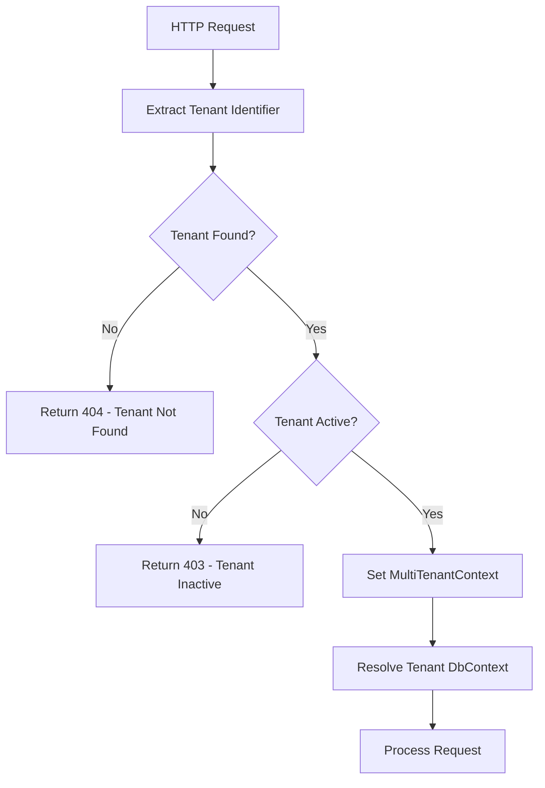

FullStackHero provides first-class multi-tenancy support using [Finbuckle.MultiTenant](https://www.finbuckle.com/MultiTenant), enabling you to build SaaS applications with complete tenant isolation. Each tenant has its own database, configuration, and data.

## Overview

The multi-tenancy system provides:

- **Database-Per-Tenant**: Complete data isolation with separate databases
- **Tenant Resolution**: Automatic tenant detection from HTTP headers, routes, or hosts
- **Tenant Management**: CRUD operations for tenant administration
- **Migration Support**: Automatic database migrations for new tenants
- **Tenant Context**: Access current tenant information throughout the application

## Architecture

### Finbuckle.MultiTenant Integration

FullStackHero uses Finbuckle.MultiTenant for multi-tenancy:

```csharp Extensions.cs
public static WebApplication UseHeroMultiTenantDatabases(
    this WebApplication app)
{
    ArgumentNullException.ThrowIfNull(app);
    app.UseMultiTenant();
    return app;
}
```

### AppTenantInfo

The `AppTenantInfo` class stores tenant information:

```csharp
public class AppTenantInfo : ITenantInfo
{
    public string Id { get; set; } = default!;
    public string Identifier { get; set; } = default!;
    public string Name { get; set; } = default!;
    public string? ConnectionString { get; set; }
    public bool IsActive { get; set; } = true;
    public DateTime CreatedOn { get; set; }
    public string? AdminEmail { get; set; }
    public string? Issuer { get; set; }
}
```

## Tenant Resolution

Tenants are identified using multiple strategies:

### 1. HTTP Header Strategy

The most common approach is using the `tenant` HTTP header:

```bash
curl -X GET https://api.example.com/api/v1/users \
  -H "tenant: acme-corp" \
  -H "Authorization: Bearer YOUR_JWT_TOKEN"
```

### 2. Route Strategy

Include the tenant in the URL path:

```
GET https://api.example.com/acme-corp/api/v1/users
```

### 3. Host Strategy

Use subdomains for tenant identification:

```
GET https://acme-corp.example.com/api/v1/users
```

<Note>
  The default configuration uses the **HTTP header strategy** with the `tenant` header. This provides the most flexibility for API clients.
</Note>

## Configuration

Configure multi-tenancy options in `appsettings.json`:

```json appsettings.json
{
  "MultitenancyOptions": {
    "RunTenantMigrationsOnStartup": true
  }
}
```

<ParamField path="RunTenantMigrationsOnStartup" type="bool" default="true">
  Whether to automatically apply migrations to all tenant databases on application startup.
</ParamField>

## Database-Per-Tenant

### Tenant Database Context

Each tenant has its own database context:

```csharp TenantDbContext.cs
public class TenantDbContext : DbContext
{
    public DbSet<AppTenantInfo> Tenants { get; set; } = default!;
    public DbSet<TenantTheme> TenantThemes { get; set; } = default!;

    public TenantDbContext(DbContextOptions<TenantDbContext> options) 
        : base(options)
    {
    }

    protected override void OnModelCreating(ModelBuilder modelBuilder)
    {
        modelBuilder.ApplyConfiguration(
            new AppTenantInfoConfiguration());
        modelBuilder.ApplyConfiguration(
            new TenantThemeConfiguration());
    }
}
```

### Accessing Tenant Context

Access the current tenant using `IMultiTenantContextAccessor`:

```csharp
public class MyService
{
    private readonly IMultiTenantContextAccessor<AppTenantInfo> _tenantAccessor;

    public MyService(
        IMultiTenantContextAccessor<AppTenantInfo> tenantAccessor)
    {
        _tenantAccessor = tenantAccessor;
    }

    public string GetCurrentTenantId()
    {
        var tenantInfo = _tenantAccessor.MultiTenantContext?.TenantInfo;
        return tenantInfo?.Id ?? throw new InvalidOperationException(
            "No tenant context available");
    }
}
```

## Tenant Management

### Creating a Tenant

Create a new tenant with its own database:

<Steps>
  <Step title="Submit Tenant Details">
    Call the create tenant endpoint with tenant information:
    
    ```bash
    POST /api/v1/multitenancy/tenants
    {
      "identifier": "acme-corp",
      "name": "Acme Corporation",
      "adminEmail": "admin@acme.com",
      "connectionString": "Server=localhost;Database=fsh_acme;..."
    }
    ```
  </Step>

  <Step title="Create Database">
    The system creates a new database for the tenant using the provided connection string.
  </Step>

  <Step title="Apply Migrations">
    All database migrations are automatically applied to the new tenant database.
  </Step>

  <Step title="Seed Initial Data">
    Default roles, permissions, and admin user are created.
  </Step>

  <Step title="Activate Tenant">
    The tenant is marked as active and ready to use.
  </Step>
</Steps>

### Tenant Activation/Deactivation

Toggle tenant activation status:

```csharp ChangeTenantActivationCommand.cs
public record ChangeTenantActivationCommand(
    string TenantId,
    bool Activate) : ICommand;
```

**Endpoint**: `PUT /api/v1/multitenancy/tenants/{id}/activation`

<CodeGroup>
```bash Activate
curl -X PUT https://api.example.com/api/v1/multitenancy/tenants/acme-corp/activation \
  -H "Content-Type: application/json" \
  -d '{ "activate": true }'
```

```bash Deactivate
curl -X PUT https://api.example.com/api/v1/multitenancy/tenants/acme-corp/activation \
  -H "Content-Type: application/json" \
  -d '{ "activate": false }'
```
</CodeGroup>

<Warning>
  Deactivating a tenant prevents all users from that tenant from accessing the system.
</Warning>

## Tenant Migrations

### Automatic Migrations

When `RunTenantMigrationsOnStartup` is enabled, migrations are applied to all tenant databases on startup.

### Manual Migration Management

Get the migration status for a tenant:

**Endpoint**: `GET /api/v1/multitenancy/tenants/{id}/migrations`

```json Response
{
  "tenantId": "acme-corp",
  "appliedMigrations": [
    "20240101000000_Initial",
    "20240115000000_AddUsers",
    "20240201000000_AddRoles"
  ],
  "pendingMigrations": [
    "20240301000000_AddGroups"
  ]
}
```

### Health Checks

The `TenantMigrationsHealthCheck` verifies tenant database health:

```csharp TenantMigrationsHealthCheck.cs
public class TenantMigrationsHealthCheck : IHealthCheck
{
    public async Task<HealthCheckResult> CheckHealthAsync(
        HealthCheckContext context,
        CancellationToken ct = default)
    {
        // Check if all tenant databases are accessible
        // and have migrations applied
    }
}
```

## Tenant Isolation

### Data Isolation

All data is completely isolated between tenants:

- Each tenant has a **separate database**
- No shared tables or data
- Queries automatically filter by tenant context

### User Isolation

Users belong to a single tenant:

- User credentials are tenant-specific
- Authentication tokens include tenant ID in claims
- Cross-tenant access is not possible

### Configuration Isolation

Tenants can have independent configuration:

```csharp
public class TenantTheme
{
    public string TenantId { get; set; } = default!;
    public string PrimaryColor { get; set; } = "#0066cc";
    public string LogoUrl { get; set; } = default!;
    public string FaviconUrl { get; set; } = default!;
}
```

## Working with Multi-Tenancy

### Command Handlers

Command handlers automatically operate within the tenant context:

```csharp
public class CreateProductHandler : ICommandHandler<CreateProductCommand, Guid>
{
    private readonly IRepository<Product> _repository;
    private readonly IMultiTenantContextAccessor<AppTenantInfo> _tenantAccessor;

    public async ValueTask<Guid> Handle(
        CreateProductCommand command,
        CancellationToken ct)
    {
        var tenantId = _tenantAccessor.MultiTenantContext?.TenantInfo?.Id;
        
        var product = Product.Create(
            command.Name,
            command.Price,
            tenantId); // Associate with current tenant
        
        await _repository.AddAsync(product, ct);
        return product.Id;
    }
}
```

### Repositories

Repositories use the tenant-specific DbContext:

```csharp
public class Repository<T> : IRepository<T> where T : class
{
    private readonly DbContext _context; // Tenant-specific context

    public async Task<T?> GetByIdAsync(Guid id, CancellationToken ct)
    {
        // Queries automatically use the tenant database
        return await _context.Set<T>()
            .FirstOrDefaultAsync(e => e.Id == id, ct);
    }
}
```

## Root Tenant

The "root" tenant is a special administrative tenant:

- Manages other tenants
- Cannot be deleted or deactivated
- Has access to tenant management endpoints

```json appsettings.json
{
  "DatabaseOptions": {
    "Provider": "POSTGRESQL",
    "ConnectionString": "Server=localhost;Database=fsh;User Id=postgres;Password=password",
    "MigrationsAssembly": "FSH.Playground.Migrations.PostgreSQL"
  }
}
```

<Note>
  The root tenant uses the default connection string from `DatabaseOptions`. All other tenants have their own connection strings.
</Note>

## Best Practices

<AccordionGroup>
  <Accordion title="Use Connection String Encryption">
    Encrypt tenant connection strings in the database. Never store them in plain text.
  </Accordion>

  <Accordion title="Implement Tenant Quotas">
    Set limits on storage, users, and API calls per tenant to prevent resource exhaustion.
  </Accordion>

  <Accordion title="Test Tenant Isolation">
    Write integration tests to verify that data cannot leak between tenants.
  </Accordion>

  <Accordion title="Monitor Tenant Databases">
    Track database size, query performance, and connection pool usage per tenant.
  </Accordion>

  <Accordion title="Backup Tenant Databases Separately">
    Implement per-tenant backup and restore capabilities.
  </Accordion>
</AccordionGroup>

## Tenant Resolution Flow



## Related Topics

<CardGroup cols={2}>
  <Card title="Authentication" icon="key" href="/features/authentication">
    Learn about tenant-aware authentication
  </Card>

  <Card title="Authorization" icon="lock" href="/features/authorization">
    Understand tenant-isolated authorization
  </Card>

  <Card title="Observability" icon="chart-line" href="/features/observability">
    Monitor tenant-specific metrics and traces
  </Card>

  <Card title="Background Jobs" icon="clock" href="/features/background-jobs">
    Run tenant-aware background jobs
  </Card>
</CardGroup>
