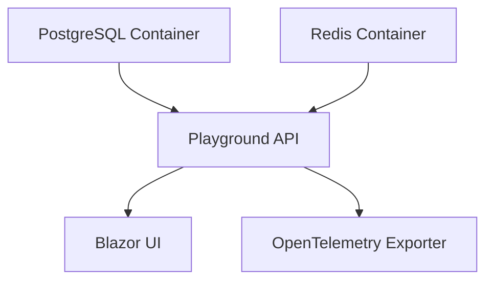

.NET Aspire is the recommended way to run the FullStackHero starter kit locally. It orchestrates PostgreSQL, Redis, and your application services with automatic service discovery, configuration injection, and observability.

## What is Aspire?

.NET Aspire is an opinionated, cloud-ready stack for building distributed applications. It provides:

<CardGroup cols={2}>
  <Card title="Service Orchestration" icon="gears">
    Manages containers, dependencies, and startup order
  </Card>
  <Card title="Service Discovery" icon="magnifying-glass">
    Automatic connection string injection between services
  </Card>
  <Card title="Configuration" icon="wrench">
    Environment variables wired automatically
  </Card>
  <Card title="Observability" icon="chart-line">
    Built-in OpenTelemetry tracing, metrics, and logs
  </Card>
</CardGroup>

## AppHost Configuration

The `FSH.Playground.AppHost` project defines the entire application topology. Here's the actual configuration:

```csharp src/Playground/FSH.Playground.AppHost/AppHost.cs
var builder = DistributedApplication.CreateBuilder(args);

// Postgres container + database
var postgres = builder.AddPostgres("postgres").WithDataVolume("fsh-postgres-data").AddDatabase("fsh");

var redis = builder.AddRedis("redis").WithDataVolume("fsh-redis-data");

builder.AddProject<Projects.Playground_Api>("playground-api")
    .WithReference(postgres)
    .WithEnvironment("ASPNETCORE_ENVIRONMENT", "Development")
    .WithEnvironment("OpenTelemetryOptions__Exporter__Otlp__Endpoint", "https://localhost:4317")
    .WithEnvironment("OpenTelemetryOptions__Exporter__Otlp__Protocol", "grpc")
    .WithEnvironment("OpenTelemetryOptions__Exporter__Otlp__Enabled", "true")
    .WithEnvironment("DatabaseOptions__Provider", "POSTGRESQL")
    .WithEnvironment("DatabaseOptions__ConnectionString", postgres.Resource.ConnectionStringExpression)
    .WithEnvironment("DatabaseOptions__MigrationsAssembly", "FSH.Playground.Migrations.PostgreSQL")
    .WaitFor(postgres)
    .WithReference(redis)
    .WithEnvironment("CachingOptions__Redis", redis.Resource.ConnectionStringExpression)
    .WithEnvironment("CachingOptions__EnableSsl", "true")
    .WaitFor(redis);

builder.AddProject<Projects.Playground_Blazor>("playground-blazor");

await builder.Build().RunAsync();
```

## How It Works

<Steps>
  <Step title="Builder Creation">
    Aspire creates a distributed application builder:

    ```csharp
    var builder = DistributedApplication.CreateBuilder(args);
    ```

    This reads configuration from `appsettings.json` and environment variables.
  </Step>

  <Step title="PostgreSQL Container">
    Adds a PostgreSQL container with persistent storage:

    ```csharp
    var postgres = builder.AddPostgres("postgres")
        .WithDataVolume("fsh-postgres-data")
        .AddDatabase("fsh");
    ```

    **What this does:**
    - Pulls `postgres:17` image from Docker Hub
    - Creates a named Docker volume `fsh-postgres-data` for persistence
    - Creates a database named `fsh`
    - Generates a connection string automatically
    - Exposes on default port `5432`
  </Step>

  <Step title="Redis Container">
    Adds a Redis container for distributed caching:

    ```csharp
    var redis = builder.AddRedis("redis")
        .WithDataVolume("fsh-redis-data");
    ```

    **What this does:**
    - Pulls `redis:7` image
    - Creates volume `fsh-redis-data`
    - Exposes on default port `6379`
  </Step>

  <Step title="Playground API Project">
    Registers the API project with service references and configuration:

    ```csharp
    builder.AddProject<Projects.Playground_Api>("playground-api")
        .WithReference(postgres)
        .WithReference(redis)
        .WaitFor(postgres)
        .WaitFor(redis);
    ```

    **Key features:**

    - **`.WithReference(postgres)`**: Injects the PostgreSQL connection string as environment variable
    - **`.WaitFor(postgres)`**: Ensures Postgres is healthy before starting the API
    - **Environment variables**: Automatically wired from Aspire to the API
  </Step>

  <Step title="Blazor UI Project">
    Registers the Blazor WebAssembly frontend:

    ```csharp
    builder.AddProject<Projects.Playground_Blazor>("playground-blazor");
    ```

    The Blazor app discovers the API via Aspire's service discovery.
  </Step>
</Steps>

## Environment Variables Injected

Aspire automatically injects these environment variables into the Playground API:

| Variable | Value | Purpose |
|----------|-------|----------|
| `ASPNETCORE_ENVIRONMENT` | `Development` | Enables development mode |
| `DatabaseOptions__Provider` | `POSTGRESQL` | Sets EF Core provider |
| `DatabaseOptions__ConnectionString` | `{postgres.connectionString}` | Auto-generated connection string |
| `DatabaseOptions__MigrationsAssembly` | `FSH.Playground.Migrations.PostgreSQL` | Migrations project |
| `CachingOptions__Redis` | `{redis.connectionString}` | Redis connection string |
| `OpenTelemetryOptions__Exporter__Otlp__Endpoint` | `https://localhost:4317` | OTLP exporter endpoint |
| `OpenTelemetryOptions__Exporter__Otlp__Enabled` | `true` | Enables telemetry export |

<Note>
  Connection strings use Aspire's `ConnectionStringExpression`, which resolves at runtime to the actual container IP and port.
</Note>

## Service Dependencies

Aspire ensures services start in the correct order:



The `.WaitFor()` method ensures health checks pass before dependent services start.

## AppHost Project Structure

```xml src/Playground/FSH.Playground.AppHost/FSH.Playground.AppHost.csproj
<Project Sdk="Aspire.AppHost.Sdk/13.1.0">
  <PropertyGroup>
    <OutputType>Exe</OutputType>
    <ImplicitUsings>enable</ImplicitUsings>
    <Nullable>enable</Nullable>
    <UserSecretsId>9fe5df9a-b9b2-4202-bdb4-d30b01b71d1a</UserSecretsId>
    <IsPackable>false</IsPackable>
  </PropertyGroup>

  <ItemGroup>
    <PackageReference Include="Aspire.Hosting.PostgreSQL" />
    <PackageReference Include="Aspire.Hosting.Redis" />
  </ItemGroup>

  <ItemGroup>
    <ProjectReference Include="..\Playground.Api\Playground.Api.csproj" />
    <ProjectReference Include="..\Playground.Blazor\Playground.Blazor.csproj" />
  </ItemGroup>
</Project>
```

Key NuGet packages:
- **`Aspire.Hosting.PostgreSQL`** (v13.1.0): PostgreSQL container hosting
- **`Aspire.Hosting.Redis`** (v13.1.0): Redis container hosting

## Running the AppHost

Start the entire stack:

```bash
dotnet run --project src/Playground/FSH.Playground.AppHost
```

**What happens:**

<Steps>
  <Step title="Container Orchestration">
    Aspire pulls Docker images and starts containers:
    
    ```bash
    docker ps
    ```
    
    You'll see `postgres` and `redis` containers running.
  </Step>

  <Step title="Health Checks">
    Aspire waits for container health checks before proceeding:
    
    - PostgreSQL: Waits for TCP connection on port 5432
    - Redis: Waits for PING response
  </Step>

  <Step title="Configuration Injection">
    Connection strings and environment variables are injected into the API.
  </Step>

  <Step title="Migration Execution">
    The Playground API calls `UseHeroMultiTenantDatabases()` which:
    
    - Applies pending EF Core migrations
    - Seeds initial data (admin user, permissions)
    - Creates tenant schemas
  </Step>

  <Step title="Service Startup">
    All services start in dependency order:
    
    - API: `https://localhost:5285`
    - Blazor: `https://localhost:7140`
  </Step>
</Steps>

## Observability

Aspire enables comprehensive observability out of the box.

### OpenTelemetry Export

The API exports telemetry to `http://localhost:4317` (OTLP gRPC endpoint):

```json From appsettings.json
{
  "OpenTelemetryOptions": {
    "Enabled": true,
    "Tracing": { "Enabled": true },
    "Metrics": {
      "Enabled": true,
      "MeterNames": ["FSH.Modules.Identity", "FSH.Modules.Multitenancy", "FSH.Modules.Auditing"]
    },
    "Exporter": {
      "Otlp": {
        "Enabled": true,
        "Endpoint": "http://localhost:4317",
        "Protocol": "grpc"
      }
    }
  }
}
```

### Traced Operations

- **HTTP requests**: ASP.NET Core instrumentation
- **EF Core queries**: Database command tracing (filtered via `FilterEfStatements`)
- **Redis commands**: StackExchange.Redis instrumentation (filtered)
- **Hangfire jobs**: Background job execution
- **Mediator handlers**: Command/query handling

### Metrics Collected

- Request duration histograms
- Module-specific meters (Identity, Multitenancy, Auditing)
- Job execution metrics
- Cache hit/miss rates

## Customizing AppHost

### Adding a New Service

To add another project or container:

```csharp
var myService = builder.AddProject<Projects.MyService>("my-service")
    .WithReference(postgres)
    .WithEnvironment("MyConfig__Value", "example")
    .WaitFor(postgres);
```

### Using SQL Server Instead

Replace PostgreSQL with SQL Server:

```csharp
var sqlserver = builder.AddSqlServer("sqlserver")
    .WithDataVolume("fsh-sqlserver-data")
    .AddDatabase("fsh");

builder.AddProject<Projects.Playground_Api>("playground-api")
    .WithReference(sqlserver)
    .WithEnvironment("DatabaseOptions__Provider", "SQLSERVER")
    .WithEnvironment("DatabaseOptions__MigrationsAssembly", "FSH.Playground.Migrations.SqlServer");
```

### Adding Jaeger for Tracing

```csharp
var jaeger = builder.AddContainer("jaeger", "jaegertracing/all-in-one")
    .WithEndpoint(16686, 16686, "ui")
    .WithEndpoint(4317, 4317, "otlp");

builder.AddProject<Projects.Playground_Api>("playground-api")
    .WithReference(jaeger)
    .WaitFor(jaeger);
```

## Data Persistence

Aspire creates named Docker volumes for data persistence:

```bash View volumes
docker volume ls | grep fsh
```

Output:
```
fsh-postgres-data
fsh-redis-data
```

Data survives container restarts. To reset:

```bash
docker volume rm fsh-postgres-data fsh-redis-data
```

## Aspire Dashboard

Aspire provides a web dashboard at `http://localhost:15000` (may vary) showing:

- Running services and their health
- Logs from all containers
- Distributed traces
- Metrics and histograms
- Environment variables

<Note>
  The dashboard URL is printed to the console when you run `dotnet run --project FSH.Playground.AppHost`.
</Note>

## Production Deployment

<Warning>
  Aspire is designed for **local development only**. For production:
  
  1. Use Kubernetes, Docker Compose, or cloud-native services (Azure Container Apps, AWS ECS)
  2. Externalize configuration to Azure Key Vault, AWS Secrets Manager, or Kubernetes Secrets
  3. Use managed databases (Azure PostgreSQL, AWS RDS) instead of containers
  4. Configure proper OTLP endpoints (Azure Monitor, Datadog, New Relic)
</Warning>

See [Deployment Guide](/deployment/overview) for production patterns.

## Next Steps

<CardGroup cols={2}>
  <Card title="Configuration" icon="sliders" href="/getting-started/configuration">
    Explore all configuration options
  </Card>
  <Card title="Observability" icon="chart-line" href="/features/observability">
    Deep dive into OpenTelemetry setup
  </Card>
  <Card title="Database" icon="database" href="/building-blocks/persistence">
    Learn about EF Core and migrations
  </Card>
  <Card title="Modules" icon="cubes" href="/modules/overview">
    Understand the modular architecture
  </Card>
</CardGroup>
